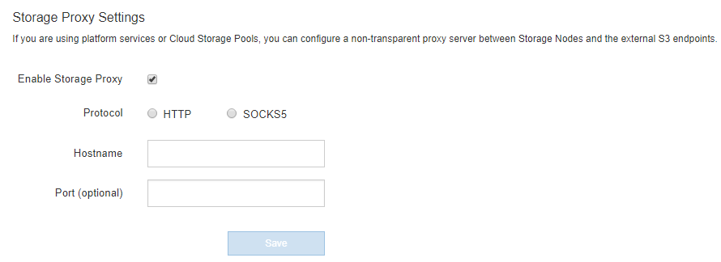

= 配置存储代理设置
:allow-uri-read: 
:icons: font
:imagesdir: ../media/

[role="lead"]
如果您使用的是平台服务或云存储池，则可以在存储节点和外部 S3 端点之间配置非透明代理。例如，您可能需要一个非透明代理来允许将平台服务消息发送到外部端点，例如 Internet 上的端点。

.开始之前
* 您具有特定的访问权限。
* 您将使用登录到网格管理器 link:../admin/web-browser-requirements.html["支持的 Web 浏览器"]。

.关于此任务
您可以为单个存储代理配置设置。

.步骤
. 选择 * 配置 * > * 安全性 * > * 代理设置 * 。
+
此时将显示存储代理设置页面。默认情况下，在边栏菜单中选择了 * 存储 * 。

+
image::../media/proxy_settings_menu_storage.png[代理设置菜单—存储]

. 选中*启用存储代理*复选框。
+
此时将显示用于配置存储代理的字段。

+

. 为非透明存储代理选择协议。
. 输入代理服务器的主机名或 IP 地址。
. （可选）输入用于连接到代理服务器的端口。
+
如果对协议使用默认端口，则可以将此字段留空： 80 表示 HTTP ， 1080 表示 SOCKS5 。

. 选择 * 保存 * 。
+
保存存储代理后，可以配置和测试平台服务或云存储池的新端点。

+

NOTE: 代理更改可能需要长达 10 分钟才能生效。

. 检查代理服务器的设置，以确保不会阻止来自 StorageGRID 的平台服务相关消息。

.完成后
如果需要禁用存储代理，请清除*启用存储代理*复选框，然后选择*保存*。

.相关信息
* link:networking-and-ports-for-platform-services.html["用于平台服务的网络和端口"]
* link:../ilm/index.html["使用 ILM 管理对象"]

