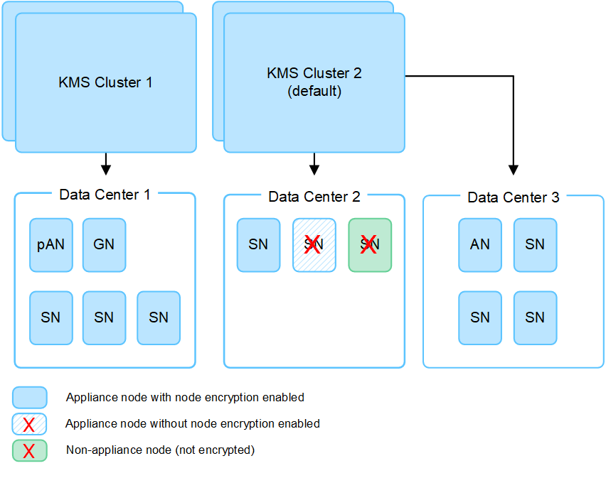

= 使用密钥管理服务器的注意事项和要求
:allow-uri-read: 
:icons: font
:imagesdir: ../media/

[role="lead"]
在配置外部密钥管理服务器（ KMS ）之前，您必须了解注意事项和要求。

== KMIP 要求是什么？

StorageGRID 支持 KMIP 1.4 版。

http://docs.oasis-open.org/kmip/spec/v1.4/os/kmip-spec-v1.4-os.html["密钥管理互操作性协议规范 1.4 版"^]

设备节点与配置的 KMS 之间的通信使用安全 TLS 连接。StorageGRID 支持 KMIP 使用以下 TLS v1.2 密码：

* tls_ECDHE_RSA_WIT_AES_256_GCM_SHA384
* tls_ECDHE_ECDSA_WIT_AES_256_GCM_SHA384

您必须确保使用节点加密的每个设备节点都可以通过网络访问为站点配置的 KMS 或 KMS 集群。

网络防火墙设置必须允许每个设备节点通过用于密钥管理互操作性协议（ Key Management Interoperability Protocol ， KMIP ）通信的端口进行通信。默认 KMIP 端口为 5696 。

== 支持哪些设备？

您可以使用密钥管理服务器（ Key Management Server ， KMS ）管理网格中启用了 * 节点加密 * 设置的任何 StorageGRID 设备的加密密钥。只有在使用 StorageGRID 设备安装程序安装设备的硬件配置阶段，才能启用此设置。

NOTE: 将设备添加到网格后、您无法启用节点加密、并且无法对未启用节点加密的设备使用外部密钥管理。

您可以对StorageGRID 设备和设备节点使用已配置的KMS。

您不能对基于软件(非设备)的节点使用已配置的KMS、包括以下节点：

* 部署为虚拟机（ VM ）的节点
* 在 Linux 主机上的容器引擎中部署的节点

在这些其他平台上部署的节点可以在数据存储库或磁盘级别使用 StorageGRID 外部的加密。

== 应在何时配置密钥管理服务器？

对于新安装，通常应在创建租户之前在网格管理器中设置一个或多个密钥管理服务器。此顺序可确保节点在存储任何对象数据之前受到保护。

您可以在安装设备节点之前或之后在网格管理器中配置密钥管理服务器。

== 我需要多少个密钥管理服务器？

您可以配置一个或多个外部密钥管理服务器，以便为 StorageGRID 系统中的设备节点提供加密密钥。每个 KMS 都为单个站点或一组站点上的 StorageGRID 设备节点提供一个加密密钥。

StorageGRID 支持使用 KMS 集群。每个 KMS 集群都包含多个复制的密钥管理服务器，这些服务器共享配置设置和加密密钥。建议使用 KMS 集群进行密钥管理，因为它可以提高高可用性配置的故障转移功能。

例如，假设您的 StorageGRID 系统有三个数据中心站点。您可以将一个 KMS 集群配置为为为 Data Center 1 上的所有设备节点提供密钥，而将另一个 KMS 集群配置为为为所有其他站点上的所有设备节点提供密钥。添加第二个 KMS 集群时，您可以为 Data Center 2 和 Data Center 3 配置默认 KMS 。

请注意，不能对非设备节点或安装期间未启用*Node Encryption设置的任何设备节点使用KMS。

== 轮换密钥时会发生什么情况？

作为安全最佳实践，您应定期轮换每个已配置的 KMS 使用的加密密钥。

在旋转加密密钥时，请使用 KMS 软件将该密钥从上次使用的版本轮换到同一密钥的新版本。不要旋转到完全不同的键。

CAUTION: 切勿尝试通过在网格管理器中更改 KMS 的密钥名称（别名）来轮换密钥。而是通过更新 KMS 软件中的密钥版本来轮换密钥。对新密钥使用与先前密钥相同的密钥别名。如果更改已配置 KMS 的密钥别名，则 StorageGRID 可能无法对数据进行解密。

新密钥版本可用时：

* 它会自动分发到与 KMS 关联的站点上的加密设备节点。分发应在轮换密钥后的一小时内完成。
* 如果在分发新密钥版本时加密设备节点脱机，则该节点将在重新启动后立即收到新密钥。
* 如果由于任何原因无法使用新密钥版本对设备卷进行加密、则会为此设备节点触发* KMS加密密钥轮换失败*警报。您可能需要联系技术支持以帮助解决此警报。

== 是否可以在设备节点加密后重复使用它？

如果需要将加密设备安装到另一个 StorageGRID 系统中，则必须先停用网格节点，才能将对象数据移动到另一个节点。然后、您可以使用StorageGRID 设备安装程序 link:../commonhardware/monitoring-node-encryption-in-maintenance-mode.html["清除KMS配置"]。清除 KMS 配置将禁用 * 节点加密 * 设置，并删除设备节点与 StorageGRID 站点的 KMS 配置之间的关联。

NOTE: 如果无法访问 KMS 加密密钥，则设备上保留的任何数据将无法再访问并永久锁定。
