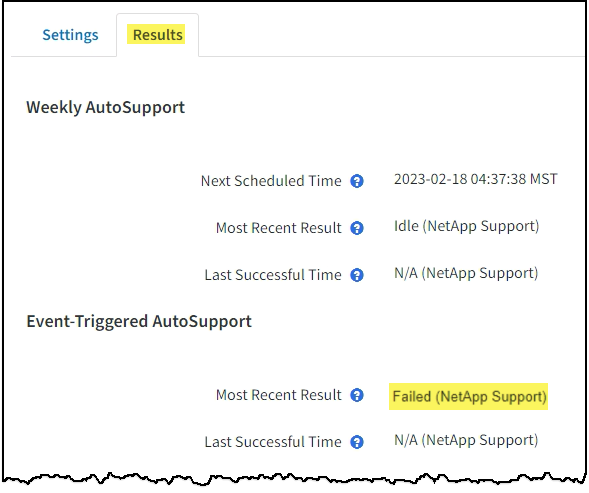

= 对 AutoSupport 消息进行故障排除
:allow-uri-read: 
:icons: font
:imagesdir: ../media/

[role="lead"]
如果尝试发送 AutoSupport 消息失败， StorageGRID 系统将根据 AutoSupport 消息的类型采取不同的操作。您可以通过选择 * 支持 * > * 工具 * > * AutoSupport * > * 结果 * 来检查 AutoSupport 消息的状态。

如果 AutoSupport 消息无法发送，则 "`failed` " 将显示在 * AutoSupport * 页面的 * 结果 * 选项卡上。

NOTE: 如果您配置了代理服务器以将AutoSupport消息转发到NetApp、则应这样做 link:configuring-admin-proxy-settings.html["验证代理服务器配置设置是否正确"]。

== 每周 AutoSupport 消息失败

如果每周 AutoSupport 消息无法发送， StorageGRID 系统将执行以下操作：

. 更新最新的 result 属性以重试。
. 尝试每四分钟重新发送 15 次 AutoSupport 消息，持续一小时。
. 发送失败一小时后，将最新结果属性更新为 Failed 。
. 尝试在下次计划的时间重新发送 AutoSupport 消息。
. 如果消息因 NMS 服务不可用而失败，并且消息在七天之前发送，则会保留常规 AutoSupport 计划。
. 当 NMS 服务再次可用时，如果消息在七天或更长时间内未发送，则会立即发送 AutoSupport 消息。

== 用户触发或事件触发的 AutoSupport 消息失败

如果用户触发或事件触发的 AutoSupport 消息无法发送， StorageGRID 系统将执行以下操作：

. 如果已知错误，则显示错误消息。例如、如果用户在选择SMTP协议时未提供正确的电子邮件配置设置、则会显示以下错误： `AutoSupport messages cannot be sent using SMTP protocol due to incorrect settings on the E-mail Server page.`
. 不会再次尝试发送消息。
. 将此错误记录在中 `nms.log`。

如果发生故障且所选协议为 SMTP ，请验证 StorageGRID 系统的电子邮件服务器是否已正确配置且电子邮件服务器是否正在运行（ * 支持 * > * 警报（原有） * > * > 旧电子邮件设置 * ）。AutoSupport 页面可能会显示以下错误消息： `AutoSupport messages cannot be sent using SMTP protocol due to incorrect settings on the E-mail Server page.`

了解操作方法 link:../monitor/email-alert-notifications.html["配置电子邮件服务器设置"]。

== 更正 AutoSupport 消息故障

如果发生故障且所选协议为 SMTP ，请验证 StorageGRID 系统的电子邮件服务器是否已正确配置且您的电子邮件服务器是否正在运行。AutoSupport 页面可能会显示以下错误消息： `AutoSupport messages cannot be sent using SMTP protocol due to incorrect settings on the E-mail Server page.`
