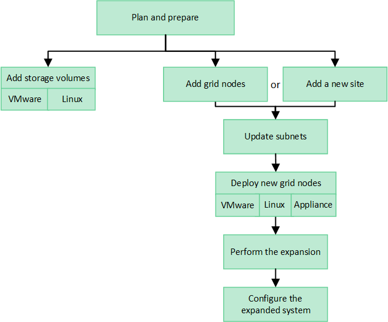

= 扩展网格：概述
:allow-uri-read: 
:icons: font
:imagesdir: ../media/

[role="lead"]
按照以下说明扩展 StorageGRID 系统的容量或功能，而不会中断系统操作。

== 关于这些说明

以下说明介绍如何执行 StorageGRID 扩展，以便向存储节点，现有站点或整个新站点添加新网格节点。

本说明适用于安装 StorageGRID 系统后负责配置和支持该系统的技术人员。

== 扩展工作流

执行扩展的原因决定了您必须添加的每种类型的新节点数以及这些新节点的位置。例如，如果要执行扩展以增加存储容量，添加元数据容量或添加冗余或新功能，则节点要求会有所不同。

如工作流中所示、执行扩展的步骤取决于是将存储卷添加到存储节点、将新节点添加到现有站点还是添加新站点。无论哪种情况，您都可以在不中断当前系统运行的情况下执行扩展。

添加节点的步骤还取决于您是添加 StorageGRID 设备还是添加运行 VMware 或 Linux 的主机。

NOTE: "`Linux` " 是指 Red Hat ® Enterprise Linux ® ， Ubuntu ® ， CentOS 或 Debian ® 部署。使用 https://imt.netapp.com/matrix/#welcome["NetApp 互操作性表工具（ IMT ）"^] 以获取支持的版本列表。

