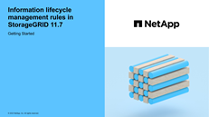

= 使用 ILM 管理对象：概述
:allow-uri-read: 
:icons: font
:imagesdir: ../media/

[role="lead"]
您可以通过配置由一个或多个ILM规则组成的信息生命周期管理(ILM)策略来管理StorageGRID 系统中的对象。ILM规则指示StorageGRID 如何创建和分发对象数据的副本、以及如何随着时间的推移管理这些副本。

== 关于这些说明

设计和实施 ILM 规则和 ILM 策略需要仔细规划。您必须了解操作要求， StorageGRID 系统的拓扑结构，对象保护需求以及可用存储类型。然后，您必须确定希望如何复制，分发和存储不同类型的对象。

按照以下说明执行以下操作：

* 了解StorageGRID ILM、包括 link:how-ilm-operates-throughout-objects-life.html["ILM如何在对象的整个生命周期内运行"]。
* 了解如何配置 link:what-storage-pool-is.html["存储池"]， link:what-cloud-storage-pool-is.html["云存储池"]，和 link:what-ilm-rule-is.html["ILM 规则"]。
* 了解操作方法 link:creating-proposed-ilm-policy.html["创建、模拟和激活ILM策略"] 这样可以保护一个或多个站点上的对象数据。
* 了解操作方法 link:managing-objects-with-s3-object-lock.html["使用S3对象锁定管理对象"]，有助于确保特定S3存储分段中的对象在指定的时间内不会被删除或覆盖。

== 了解更多信息。

要了解更多信息，请查看以下视频：

* https://["视频：StorageGRID 11.7中的信息生命周期管理规则"^]。
+
[link=https://netapp.hosted.panopto.com/Panopto/Pages/Viewer.aspx?id=6baa2e69-95b7-4bcf-a0ff-afbd0092231c]

* https://["视频：StorageGRID 11.7中的信息生命周期管理策略"^]
+
[link=https://netapp.hosted.panopto.com/Panopto/Pages/Viewer.aspx?id=0009ebe1-3665-4cdc-a101-afbd009a0466]
image::../media/video-screenshot-ilm-policies-117.png[视频：StorageGRID 11.7中的信息生命周期管理策略]

