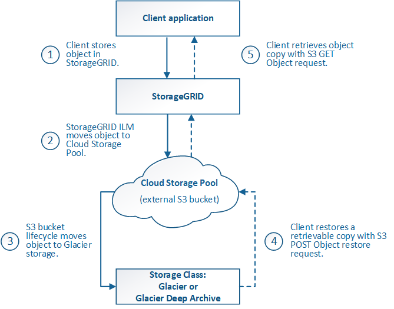

= 云存储池对象的生命周期
:allow-uri-read: 
:icons: font
:imagesdir: ../media/

[role="lead"]
在实施云存储池之前，请查看存储在每种类型的云存储池中的对象的生命周期。

* <<S3 ：云存储池对象的生命周期>>
* <<Azure ： Cloud Storage Pool 对象的生命周期>>

== S3 ：云存储池对象的生命周期

此图显示了存储在 S3 云存储池中的对象的生命周期阶段。

NOTE: 在图和说明中， "`Glacier` " 是指 Glacier 存储类和 Glacier 深度归档存储类，但有一个例外： Glacier 深度归档存储类不支持加急还原层。仅支持批量或标准检索。

NOTE: Google Cloud Platform （ GCP ）支持从长期存储中检索对象，而无需执行还原后操作。

. * 存储在 StorageGRID 中的对象 *
+
要开始生命周期，客户端应用程序会将对象存储在 StorageGRID 中。

. * 对象已移至 S3 云存储池 *
+
** 如果对象与使用 S3 云存储池作为其放置位置的 ILM 规则匹配，则 StorageGRID 会将此对象移动到云存储池指定的外部 S3 存储分段。
** 将对象移动到 S3 云存储池后，客户端应用程序可以使用来自 StorageGRID 的 S3 GET 对象请求来检索该对象，除非该对象已过渡到 Glacier 存储。

. * 已过渡到 Glacier 的对象（无法检索状态） *
+
** 也可以将对象过渡到 Glacier 存储。例如，外部 S3 存储分段可能会使用生命周期配置立即或在一定天数后将对象过渡到 Glacier 存储。
+

NOTE: 如果要过渡对象，必须为外部 S3 存储分段创建生命周期配置，并且必须使用实施 Glacier 存储类并支持 S3 后对象还原 API 的存储解决方案 。

+

NOTE: 请勿对Swift客户端已导出的对象使用云存储池。Swift 不支持后对象还原请求，因此 StorageGRID 将无法检索已过渡到 S3 Glacier 存储的任何 Swift 对象。发出 Swift GET 对象请求以检索这些对象将失败（ 403 已禁用）。

** 过渡期间，客户端应用程序可以使用 S3 head Object 请求来监控对象的状态。

. * 对象已从 Glacier 存储还原 *
+
如果对象已过渡到 Glacier 存储，则客户端应用程序可以通过问题描述 处理 S3 后对象还原请求，将可检索的副本还原到 S3 云存储池。此请求指定在云存储池和数据访问层中应使用多少天的副本来执行还原操作（加急，标准或批量）。达到可检索副本的到期日期后，该副本将自动恢复为无法检索的状态。

+

NOTE: 如果 StorageGRID 中的存储节点上也存在对象的一个或多个副本，则无需发出 POST 对象还原请求来从 Glacier 中还原对象。相反，可以使用 GET 对象请求直接检索本地副本。

. * 已检索对象 *
+
还原对象后，客户端应用程序可以通过问题描述 获取对象请求来检索还原的对象。

== Azure ： Cloud Storage Pool 对象的生命周期

此图显示了存储在 Azure 云存储池中的对象的生命周期阶段。

image::../media/cloud_storage_pool_object_life_cycle_azure.png[Azure Cloud Storage Pool 对象的生命周期]

. * 存储在 StorageGRID 中的对象 *
+
要开始生命周期，客户端应用程序会将对象存储在 StorageGRID 中。

. * 对象已移至 Azure Cloud Storage Pool*
+
如果对象与使用 Azure 云存储池作为其放置位置的 ILM 规则匹配，则 StorageGRID 会将此对象移动到云存储池指定的外部 Azure Blob 存储容器

+

NOTE: 请勿对Swift客户端已导出的对象使用云存储池。Swift 不支持后对象还原请求，因此 StorageGRID 将无法检索已过渡到 Azure Blob 存储归档层的任何 Swift 对象。发出 Swift GET 对象请求以检索这些对象将失败（ 403 已禁用）。

. * 已过渡到归档层的对象（无法检索状态） *
+
将对象移动到 Azure 云存储池后， StorageGRID 会立即自动将对象过渡到 Azure Blob 存储归档层。

. * 对象已从归档层还原 *
+
如果某个对象已过渡到归档层，则客户端应用程序可以通过问题描述 处理 S3 后对象还原请求将可检索的副本还原到 Azure 云存储池。

+
当 StorageGRID 收到后对象还原时，它会暂时将对象过渡到 Azure Blob 存储冷却层。一旦达到 POST 对象还原请求中的到期日期， StorageGRID 就会将该对象过渡回归档层。

+

NOTE: 如果 StorageGRID 中的存储节点上也存在对象的一个或多个副本，则无需通过发出 POST 对象还原请求从归档访问层还原对象。相反，可以使用 GET 对象请求直接检索本地副本。

. * 已检索对象 *
+
将对象还原到 Azure 云存储池后，客户端应用程序可以通过问题描述 获取对象请求来检索还原的对象。

.相关信息
link:../s3/index.html["使用S3 REST API"]
