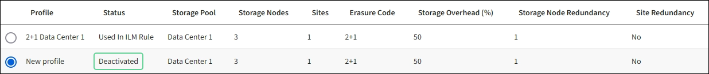

= 管理纠删编码配置文件
:allow-uri-read: 
:icons: font
:imagesdir: ../media/

[role="lead"]
如果需要、您可以重命名纠删编码配置文件。如果纠删编码配置文件当前未在任何ILM规则中使用、则可以停用该配置文件。

== 重命名纠删编码配置文件

您可能需要重命名纠删编码配置文件、以便更清楚地显示该配置文件的功能。

.开始之前
* 您将使用登录到网格管理器 link:../admin/web-browser-requirements.html["支持的 Web 浏览器"]。
* 您拥有 link:../admin/admin-group-permissions.html["所需的访问权限"]。

.步骤
. 选择 * ILM * > * 擦除编码 * 。
. 选择要重命名的配置文件。
. 选择 * 重命名 * 。
. 为纠删编码配置文件输入一个唯一名称。
+
纠删编码配置文件名称会附加到ILM规则放置指令中的存储池名称中。

+

NOTE: 纠删编码配置文件名称必须唯一。如果您使用现有配置文件的名称，则会发生验证错误，即使该配置文件已停用也是如此。

. 选择 * 保存 * 。

== 停用纠删编码配置文件

如果您不再计划使用纠删编码配置文件、并且该配置文件当前未在任何ILM规则中使用、则可以停用该配置文件。

.开始之前
* 您将使用登录到网格管理器 link:../admin/web-browser-requirements.html["支持的 Web 浏览器"]。
* 您拥有 link:../admin/admin-group-permissions.html["所需的访问权限"]。
* 您已确认没有正在执行纠删编码的数据修复操作或停用过程。如果在执行上述任一操作时尝试停用纠删编码配置文件、则会返回一条错误消息。

.关于此任务
停用纠删编码配置文件时，该配置文件仍显示在纠删编码配置文件页面上，但其状态为*DEactive*。

您无法再使用已停用的纠删编码配置文件。为 ILM 规则创建放置说明时，不会显示已停用的配置文件。您无法重新激活已停用的配置文件。

如果满足以下任一条件、StorageGRID 将阻止您停用纠删编码配置文件：

* 纠删编码配置文件当前在ILM规则中使用。
* 纠删编码配置文件不再用于任何ILM规则、但该配置文件的对象数据和奇偶校验片段仍然存在。

.步骤
. 选择 * ILM * > * 擦除编码 * 。
. 查看*Status*列，确认要停用的纠删编码配置文件未在任何ILM规则中使用。
+
如果纠删编码配置文件在任何ILM规则中使用、则无法停用该配置文件。在此示例中，至少在一个ILM规则中使用了*2+1数据中心1*配置文件。

+
image::../media/ec_profile_used_in_ilm_rule.png[ILM 规则中使用的 EC 配置文件]

. 如果在 ILM 规则中使用配置文件，请执行以下步骤：
+
.. 选择 * ILM * > * 规则 * 。
.. 选择每个规则并查看保留图、以确定该规则是否使用要停用的纠删编码配置文件。
.. 如果ILM规则使用要停用的纠删编码配置文件、请确定该规则是在活动ILM策略中使用还是在建议的策略中使用。
.. 根据纠删编码配置文件的使用位置、完成表中的其他步骤。
+
[cols="2a,4a,1a"]
|===
| 此配置文件已在何处使用？ | 停用配置文件前要执行的其他步骤 | 请参见这些附加说明 

 a| 
从不在任何 ILM 规则中使用
 a| 
无需执行其他步骤。继续执行此操作步骤。
 a| 
无 _

 a| 
在从未在任何 ILM 策略中使用过的 ILM 规则中
 a| 
... 编辑或删除所有受影响的 ILM 规则。如果编辑规则、请删除使用纠删编码配置文件的所有放置。
... 继续执行此操作步骤。

 a| 
link:working-with-ilm-rules-and-ilm-policies.html["使用 ILM 规则和 ILM 策略"]

 a| 
当前处于活动 ILM 策略中的 ILM 规则中
 a| 
... 克隆活动策略。
... 删除使用纠删编码配置文件的ILM规则。
... 添加一个或多个新 ILM 规则以确保对象受到保护。
... 保存，模拟和激活新策略。
... 等待应用新策略，并根据添加的新规则将现有对象移动到新位置。
+
* 注意： * 根据对象数量和 StorageGRID 系统的大小， ILM 操作可能需要数周甚至数月才能根据新的 ILM 规则将对象移动到新位置。

+
虽然您可以安全地尝试停用仍与数据关联的纠删编码配置文件、但停用操作将失败。如果配置文件尚未准备好停用，则会显示一条错误消息通知您。

... 编辑或删除从策略中删除的规则。如果编辑规则、请删除使用纠删编码配置文件的所有放置。
... 继续执行此操作步骤。

 a| 
link:creating-ilm-policy.html["创建 ILM 策略"]

link:working-with-ilm-rules-and-ilm-policies.html["使用 ILM 规则和 ILM 策略"]

 a| 
当前在建议的 ILM 策略中的 ILM 规则
 a| 
... 编辑建议的策略。
... 删除使用纠删编码配置文件的ILM规则。
... 添加一个或多个新的 ILM 规则以确保所有对象均受保护。
... 保存建议的策略。
... 编辑或删除从策略中删除的规则。如果编辑规则、请删除使用纠删编码配置文件的所有放置。
... 继续执行此操作步骤。

 a| 
link:creating-ilm-policy.html["创建 ILM 策略"]

link:working-with-ilm-rules-and-ilm-policies.html["使用 ILM 规则和 ILM 策略"]

 a| 
在历史 ILM 策略中的 ILM 规则中
 a| 
... 编辑或删除规则。如果编辑规则、请删除使用纠删编码配置文件的所有放置。（此规则现在将在历史策略中显示为历史规则。）
... 继续执行此操作步骤。

 a| 
link:working-with-ilm-rules-and-ilm-policies.html["使用 ILM 规则和 ILM 策略"]

|===
.. 刷新擦除编码配置文件页面，以确保此配置文件未在 ILM 规则中使用。

. 如果在 ILM 规则中未使用该配置文件，请选择单选按钮并选择 * 停用 * 。
+
此时将显示停用 EC 配置文件对话框。

. 如果确实要停用此配置文件，请选择 * 停用 * 。
+
** 如果StorageGRID 能够停用纠删编码配置文件，其状态为*DEactive*。您不能再为任何 ILM 规则选择此配置文件。
** 如果 StorageGRID 无法停用此配置文件，则会显示一条错误消息。例如，如果对象数据仍与此配置文件关联，则会显示一条错误消息。您可能需要等待几周才能再次尝试停用过程。

