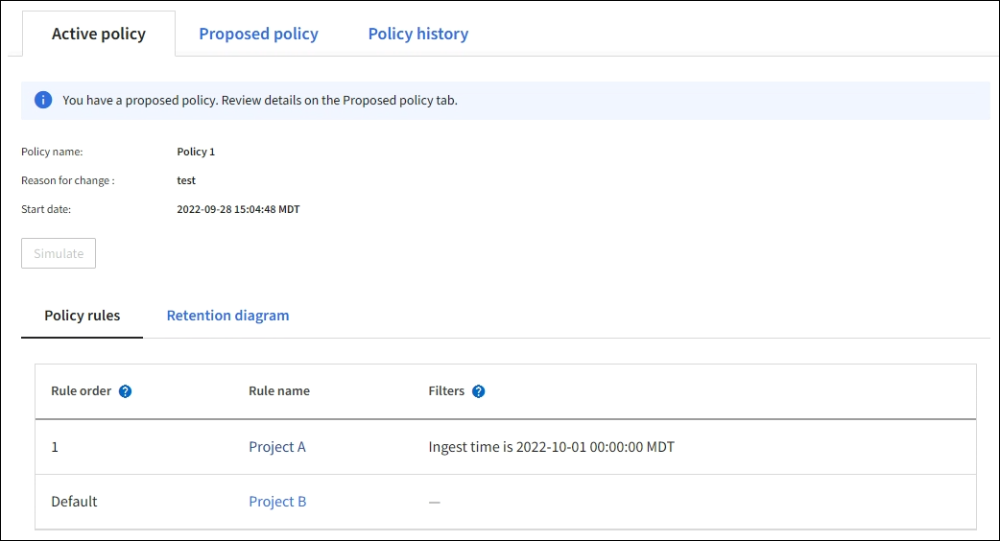

= 使用ILM策略和ILM规则
:allow-uri-read: 
:icons: font
:imagesdir: ../media/

[role="lead"]
随着存储要求的变化、您可能需要设置不同的策略或修改与该策略关联的ILM规则。您可以查看ILM指标来确定系统性能。

.开始之前
* 您将使用登录到网格管理器 link:../admin/web-browser-requirements.html["支持的 Web 浏览器"]。
* 您具有特定的访问权限。

== 查看ILM策略

要查看活动、建议和历史ILM策略、请执行以下操作：

. 选择 * ILM * > * 策略 * 。
. 根据需要，选择*Active policy*、*proxed policy*或*Policy history*以查看每个策略的详细信息。在每个选项卡中，您可以选择*策略规则*和*保留图*。

== 克隆历史ILM策略

克隆历史ILM策略：

. 选择*ilm*>*policies*>*Policy histo*。
. 删除建议的策略(如果存在)。
. 选择要克隆的策略对应的单选按钮，然后选择*Clone historical policy*。
. 按照中的说明完成所需的详细信息 link:creating-proposed-ilm-policy.html["创建建议的 ILM 策略"]。

CAUTION: 配置不正确的 ILM 策略可能导致无法恢复的数据丢失。激活 ILM 策略之前，请仔细查看 ILM 策略及其 ILM 规则，然后模拟 ILM 策略。请始终确认 ILM 策略将按预期运行。

== 删除建议的ILM策略

删除建议的策略：

. 选择*ilm*>*policies*>*proproproproproxi*。
. 选择 * 操作 * > * 删除 * 。

此时将删除建议的策略和建议的策略选项卡。

== 查看ILM规则详细信息

要查看ILM规则的详细信息、包括规则的保留图和放置说明、请执行以下操作：

. 选择 * ILM * > * 规则 * 。
. 选择要查看其详细信息的规则。示例
+
image::../media/ilm_rule_details_page.png[ILM规则详细信息页面]

此外、您还可以使用详细信息页面克隆、编辑或删除规则。

== 克隆 ILM 规则

如果某个规则正在建议的ILM策略或活动ILM策略中使用、则无法编辑此规则。而是可以克隆规则并对克隆的副本进行任何必要的更改。然后，如果需要，您可以从建议的策略中删除原始规则，并将其替换为修改后的版本。如果ILM规则是使用StorageGRID 10.2或更早版本创建的、则无法克隆该规则。

在将克隆规则添加到活动 ILM 策略发生原因 之前，请注意，更改对象的放置指令可能会导致系统负载增加。

.步骤
. 选择 * ILM * > * 规则 * 。
. 选中要克隆的规则对应的复选框，然后选择*Clone。或者，也可以选择规则名称，然后从规则详细信息页面中选择*Clone。
. 按照的步骤更新克隆的规则 <<编辑 ILM 规则,编辑ILM规则>> 和 link:create-ilm-rule-enter-details.html#use-advanced-filters-in-ilm-rules["在ILM规则中使用高级筛选器"]。
+
克隆 ILM 规则时，必须输入新名称。

== 编辑 ILM 规则

要更改筛选器或放置指令，您可能需要编辑 ILM 规则。

如果某个规则正在活动ILM策略或建议的ILM策略中使用、则无法编辑此规则。而是可以克隆这些规则并对克隆的副本进行任何必要的更改。您也无法编辑系统提供的规则、请创建2个副本。

NOTE: 在将已编辑的规则添加到活动 ILM 策略发生原因 之前，请注意，更改对象的放置指令可能会导致系统负载增加。

.步骤
. 选择 * ILM * > * 规则 * 。
. 确认要编辑的规则未在活动ILM策略或建议的ILM策略中使用。
. 如果要编辑的规则未在使用中，请选中该规则的复选框，然后选择*Actions*>*Edit*。或者，选择规则的名称，然后在规则详细信息页面上选择*Edit*。
. 完成编辑ILM规则向导的各个页面。如有必要、请按照的步骤进行操作 link:create-ilm-rule-enter-details.html["创建 ILM 规则"] 和 link:create-ilm-rule-enter-details.html#use-advanced-filters-in-ilm-rules["在ILM规则中使用高级筛选器"]。
+
编辑ILM规则时、不能更改其名称。

+

NOTE: 如果编辑历史策略中使用的规则、则 image:../media/icon_ilm_rule_historical.png["图标 ILM 规则历史记录"] 查看策略时会显示规则图标，表示此规则已成为历史规则。

== 删除ILM规则

要使当前ILM规则列表易于管理、请删除您不可能使用的任何ILM规则。

.步骤
要删除当前在活动策略或建议策略中使用的ILM规则、请执行以下操作：

. 克隆活动策略或编辑建议的策略。
. 从策略中删除 ILM 规则。
. 保存，模拟和激活新策略，以确保对象按预期受到保护。

删除当前未使用的ILM规则：

. 选择 * ILM * > * 规则 * 。
. 确认要删除的规则未在活动策略或建议的策略中使用。
. 如果要删除的规则未在使用中，请选择该规则并选择*Remove*。您可以选择多个规则并同时删除所有规则。
. 选择*是*确认要删除ILM规则。
+
此时将删除ILM规则。

+

NOTE: 如果删除历史策略中使用的规则、则 image:../media/icon_ilm_rule_historical.png["图标 ILM 规则历史记录"] 查看策略时会显示规则图标，表示此规则已成为历史规则。

== 查看ILM指标

您可以查看ILM的指标、例如队列中的对象数量和评估速率。您可以监控这些指标以确定系统性能。队列或评估速率较高可能表示系统无法跟上载入速率、客户端应用程序的负载过大或存在某些异常情况。

.步骤
. 选择*信息板*>* ILM *。
+

NOTE: 由于可以自定义信息板、因此ILM选项卡可能不可用。

. 监控ILM选项卡上的指标。
+
您可以选择问号 image:../media/icon_nms_question.png["问号图标"] 以查看ILM选项卡上各项的问题描述。

+
image::../media/ilm_metrics_on_dashboard.png[Grid Manager信息板上的ILM指标]

