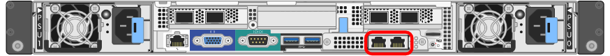
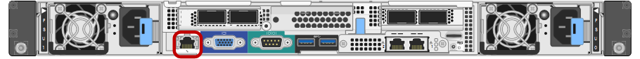

= 收集安装信息（ SG100 和 SG1000 ）
:allow-uri-read: 
:icons: font
:imagesdir: ../media/

[role="lead"]
使用表记录连接到设备的每个网络所需的信息。安装和配置硬件需要这些值。

TIP: 请使用随ConfigBuilder提供的工作簿、而不是使用这些表。通过使用ConfigBuilder工作簿、您可以上传系统信息并生成JSON文件、以自动完成StorageGRID 设备安装程序中的某些配置步骤。请参见 link:automating-appliance-installation-and-configuration.html["自动安装和配置设备"]。

== 检查StorageGRID 版本

在安装SG100或SG1000服务设备之前、请确认您的StorageGRID 系统正在使用所需版本的StorageGRID 软件。

[cols="1a,2a"]
|===
| 设备 | 所需的 StorageGRID 版本 

 a| 
SG1000
 a| 
11.3 或更高版本（建议使用最新的修补程序）

 a| 
SG100
 a| 
11.4 或更高版本（建议使用最新的修补程序）

|===

== 管理和维护端口

StorageGRID 管理网络是一个可选网络，用于系统管理和维护。此设备使用设备上的以下 1-GbE 管理端口连接到管理网络。

SG100 RJ-45端口：

SG1000 RJ-45端口：

image::../media/sg1000_rj_45_ports_circled.png[SG1000 RJ-45 端口]

[cols="2a,1a"]
|===
| 所需信息 | 您的价值 

 a| 
已启用管理网络
 a| 
选择一项：

* 否
* 是（默认）

 a| 
网络绑定模式
 a| 
选择一项：

* 独立（默认）
* 主动备份

 a| 
图中圈出的左侧端口的交换机端口（独立网络绑定模式的默认活动端口）
 a| 

 a| 
图中圈出的右侧端口的交换机端口（仅限主动备份网络绑定模式）
 a| 

 a| 
管理网络端口的 MAC 地址

* 注： * 设备正面的 MAC 地址标签列出了 BMC 管理端口的 MAC 地址。要确定管理网络端口的MAC地址，请将*2*添加到标签上的十六进制数字中。例如，如果标签上的 MAC 地址以 *09* 结尾，则管理端口的 MAC 地址将以 *0B* 结尾。如果标签上的 MAC 地址以 * （ _y_ ） FF* 结尾，则管理端口的 MAC 地址将以 * （ _y_+1 ） 01* 结尾。您可以通过在 Windows 中打开 Calculator ，将其设置为程序编程模式，选择十六进制，键入 MAC 地址，然后键入 * + 2 =* 来轻松进行计算。
 a| 

 a| 
DHCP 为管理网络端口分配的 IP 地址（如果在启动后可用）

* 注： * 您可以使用 MAC 地址查找已分配的 IP 来确定 DHCP 分配的 IP 地址。
 a| 
* IPv4 地址（ CIDR ）：
* 网关

 a| 
您计划在管理网络上用于设备节点的静态 IP 地址

* 注： * 如果您的网络没有网关，请为此网关指定相同的静态 IPv4 地址。
 a| 
* IPv4 地址（ CIDR ）：
* 网关

 a| 
管理网络子网（ CIDR ）
 a| 

|===

== 网络端口

设备上的四个网络端口连接到 StorageGRID 网格网络和可选客户端网络。

[cols="2a,1a"]
|===
| 所需信息 | 您的价值 

 a| 
链路速度
 a| 
对于 SG100 ，请选择以下选项之一：

* 自动（默认）
* 10 GbE
* 25 GbE

对于 SG1000 ，请选择以下选项之一：

* 自动（默认）
* 10 GbE
* 25 GbE
* 40 GbE
* 100 GbE

* 注： * 对于 SG1000 ， 10-GbE 和 25-GbE 速度要求使用 QSA 适配器。

 a| 
端口绑定模式
 a| 
选择一项：

* FIXED （默认）
* 聚合

 a| 
端口 1 的交换机端口（固定模式的客户端网络）
 a| 

 a| 
端口 2 的交换机端口（固定模式的网格网络）
 a| 

 a| 
端口 3 的交换机端口（固定模式的客户端网络）
 a| 

 a| 
端口 4 的交换机端口（固定模式的网格网络）
 a| 

|===

== 网格网络端口

适用于 StorageGRID 的网格网络是一个必需的网络，用于所有内部 StorageGRID 流量。此设备使用四个网络端口连接到网格网络。

[cols="2a,1a"]
|===
| 所需信息 | 您的价值 

 a| 
网络绑定模式
 a| 
选择一项：

* Active-Backup （默认）
* LACP （ 802.3ad ）

 a| 
已启用 VLAN 标记
 a| 
选择一项：

* 否（默认）
* 是的。

 a| 
VLAN 标记（如果启用了 VLAN 标记）
 a| 
输入一个介于 0 到 4095 之间的值：

 a| 
DHCP 为网格网络分配的 IP 地址（如果在启动后可用）
 a| 
* IPv4 地址（ CIDR ）：
* 网关

 a| 
您计划用于网格网络上设备节点的静态 IP 地址

* 注： * 如果您的网络没有网关，请为此网关指定相同的静态 IPv4 地址。
 a| 
* IPv4 地址（ CIDR ）：
* 网关

 a| 
网格网络子网（ GRID ）
 a| 

 a| 
最大传输单元（ Maximum Transmission Unit ， MTU ）设置（可选）您可以使用默认值 1500 ，也可以将 MTU 设置为适合巨型帧的值，例如 9000 。
 a| 

|===

== 客户端网络端口

适用于 StorageGRID 的客户端网络是一个可选网络，通常用于提供对网格的客户端协议访问。此设备使用四个网络端口连接到客户端网络。

[cols="2a,1a"]
|===
| 所需信息 | 您的价值 

 a| 
已启用客户端网络
 a| 
选择一项：

* 否（默认）
* 是的。

 a| 
网络绑定模式
 a| 
选择一项：

* Active-Backup （默认）
* LACP （ 802.3ad ）

 a| 
已启用 VLAN 标记
 a| 
选择一项：

* 否（默认）
* 是的。

 a| 
VLAN标记(如果启用了VLAN标记)
 a| 
输入一个介于 0 到 4095 之间的值：

 a| 
DHCP 为客户端网络分配的 IP 地址（如果在启动后可用）
 a| 
* IPv4 地址（ CIDR ）：
* 网关

 a| 
您计划在客户端网络上用于设备节点的静态 IP 地址

* 注意： * 如果启用了客户端网络，则设备上的默认路由将使用此处指定的网关。
 a| 
* IPv4 地址（ CIDR ）：
* 网关

|===

== BMC 管理网络端口

您可以使用图中圈出的 1-GbE 管理端口访问服务设备上的 BMC 接口。此端口支持使用智能平台管理接口（ Intelligent Platform Management Interface ， IPMI ）标准通过以太网远程管理控制器硬件。

NOTE: 您可以使用管理API专用端点put /privation/bmc为包含BMC的所有设备启用或禁用远程IPMI访问。

SG100 BMC管理端口：

image::../media/sg100_bmc_management_port.png[SG100 管理端口]

SG1000 BMC管理端口：

[cols="2a,1a"]
|===
| 所需信息 | 您的价值 

 a| 
要连接到 BMC 管理端口的以太网交换机端口（在图中圈出）
 a| 

 a| 
为 BMC 管理网络分配的 DHCP IP 地址（如果在启动后可用）
 a| 
* IPv4 地址（ CIDR ）：
* 网关

 a| 
您计划用于 BMC 管理端口的静态 IP 地址
 a| 
* IPv4 地址（ CIDR ）：
* 网关

|===
.相关信息
* link:cabling-appliance-sg100-and-sg1000.html["缆线设备（ SG100 和 SG1000 ）"]
* link:setting-ip-configuration.html["配置 StorageGRID IP 地址"]

