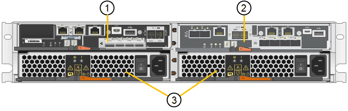

= SG5700设备：概述
:allow-uri-read: 
:icons: font
:imagesdir: ../media/

[role="lead"]
SG5700 StorageGRID 设备是一个集成的存储和计算平台，作为 StorageGRID 网格中的存储节点运行。此设备可在混合网格环境中使用，该环境将设备存储节点与虚拟（基于软件的）存储节点相结合。

StorageGRID SG5700系列设备具有以下功能：

* 集成 StorageGRID 存储节点的存储和计算要素。
* 包括 StorageGRID 设备安装程序，以简化存储节点的部署和配置。
* 包括用于硬件管理和监控的 E 系列 SANtricity System Manager 。
* 最多支持四个连接到 StorageGRID 网格网络和客户端网络的 10-GbE 或 25-GbE 连接。
* 支持全磁盘加密(Full Disk Encryption、FD)驱动器或FIPS驱动器。如果将这些驱动器与 SANtricity 系统管理器中的驱动器安全功能结合使用，则会阻止未经授权的数据访问。

SG5700设备有四种型号：SG5712和SG5712X以及SG5760和SG5760X。除了存储控制器上互连端口的位置之外、SG5712和SG5712X之间在规格或功能上没有区别。同样、除了存储控制器上互连端口的位置之外、SG5760和SG5760X在规格或功能上没有任何区别。

== SG5700组件

SG5700型号包括以下组件：

[cols="1a,1a,1a,1a,1a"]
|===
| 组件 | SG5712 | SG5712X | SG5760 | SG5760X 

 a| 
计算控制器
 a| 
E5700SG 控制器
 a| 
E5700SG 控制器
 a| 
E5700SG 控制器
 a| 
E5700SG 控制器

 a| 
存储控制器
 a| 
E2800A控制器
 a| 
E2800B控制器
 a| 
E2800A控制器
 a| 
E2800B控制器

 a| 
机箱
 a| 
E 系列 DE212C 机箱，一个双机架单元（ 2U ）机箱
 a| 
E 系列 DE212C 机箱，一个双机架单元（ 2U ）机箱
 a| 
E 系列 DE460C 机箱，一个四机架单元（ 4U ）机箱
 a| 
E 系列 DE460C 机箱，一个四机架单元（ 4U ）机箱

 a| 
驱动器
 a| 
12 个 NL-SAS 驱动器（ 3.5 英寸）
 a| 
12 个 NL-SAS 驱动器（ 3.5 英寸）
 a| 
60 个 NL-SAS 驱动器（ 3.5 英寸）
 a| 
60 个 NL-SAS 驱动器（ 3.5 英寸）

 a| 
冗余电源和风扇
 a| 
两个电源风扇箱
 a| 
两个电源风扇箱
 a| 
两个电源箱和两个风扇箱
 a| 
两个电源箱和两个风扇箱

|===
根据每个机箱中的驱动器数量， StorageGRID 设备中可用的最大原始存储空间是固定的。您不能通过添加具有额外驱动器的磁盘架来扩展可用存储。

== SG5700示意图

=== SG5712正面图和背面图

图中显示了SG5712的正面和背面、SG5712是一个2U机箱、可容纳12个驱动器。

image::../media/sg5712_front_and_back_views.gif[SG5712 设备的正面和背面]

=== SG5712组件

SG5712 包括两个控制器和两个电源风扇箱。

image::../media/sg5712_with_callouts.gif[SG5712 设备中的控制器和电源风扇箱]

[cols="1a,3a"]
|===
| Callout | Description 

 a| 
1.
 a| 
E2800A控制器(存储控制器)

 a| 
2.
 a| 
E5700SG 控制器（计算控制器）

 a| 
3.
 a| 
电源风扇箱

|===

=== SG5712X正面图和背面图

图中显示了SG5712X的正面和背面、SG5712X是一个2U机箱、可容纳12个驱动器。

image::../media/sg5712x_front_and_back_views.gif[SG5712X设备的正面和背面]

=== SG5712X组件

SG5712X包括两个控制器和两个电源风扇箱。

[cols="1a,3a"]
|===
| Callout | Description 

 a| 
1.
 a| 
E2800B控制器(存储控制器)

 a| 
2.
 a| 
E5700SG 控制器（计算控制器）

 a| 
3.
 a| 
电源风扇箱

|===

=== SG5760正面图和背面图

图中显示了SG5760型号的正面和背面、SG5760是一个4U机箱、可在5个驱动器抽盒中容纳60个驱动器。

image::../media/sg5760_front_and_back_views.gif[SG5760 设备的正面和背面]

=== SG5760组件

SG5760 包括两个控制器，两个风扇箱和两个电源箱。

image::../media/sg5760_with_callouts.gif[控制器,fan canisters,and power canisters in SG5760 appliance]

[cols="1a,2a"]
|===
| Callout | Description 

 a| 
1.
 a| 
E2800A控制器(存储控制器)

 a| 
2.
 a| 
E5700SG 控制器（计算控制器）

 a| 
3.
 a| 
风扇箱（第 1 页，共 2 页）

 a| 
4.
 a| 
电源箱（第 1 页，共 2 页）

|===

=== SG5760X正面图和背面图

图中显示了SG5760X型号的正面和背面、SG5760X是一个4U机箱、可在5个驱动器抽盒中容纳60个驱动器。

image::../media/sg5760x_front_and_back_views.gif[SG5760X设备的正面和背面]

=== SG5760X组件

SG5760X包括两个控制器、两个风扇箱和两个电源箱。

image::../media/sg5760x_with_callouts.gif[控制器,fan canisters,and power canisters in SG5760X appliance]

[cols="1a,3a"]
|===
| Callout | Description 

 a| 
1.
 a| 
E2800B控制器(存储控制器)

 a| 
2.
 a| 
E5700SG 控制器（计算控制器）

 a| 
3.
 a| 
风扇箱（第 1 页，共 2 页）

 a| 
4.
 a| 
电源箱（第 1 页，共 2 页）

|===
.相关信息
http://["NetApp E 系列系统文档站点"^]
