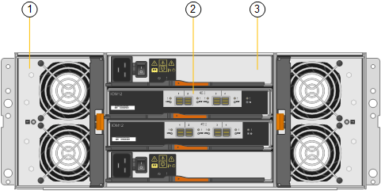

= SG6060和SG6060X设备：概述
:allow-uri-read: 
:icons: font
:imagesdir: ../media/

[role="lead"]
StorageGRID SG6060和SG60X设备各包含一个计算控制器和一个存储控制器架、其中包含两个存储控制器和60个驱动器。

也可以在这两个设备中添加60个驱动器的扩展架。除了存储控制器上互连端口的位置之外、SG6060和SG6060X之间在规格或功能上没有区别。

== SG6060和SG6060X组件

SG6060和SG6060X设备包括以下组件：

[cols="1a,2a"]
|===
| 组件 | Description 

 a| 
计算控制器
 a| 
SG6000-CN 控制器，一种单机架单元（ 1U ）服务器，其中包括：

* 40 个核心（ 80 个线程）
* 192 GB RAM
* 高达 4 × 25 Gbps 聚合以太网带宽
* 4 × 16 Gbps 光纤通道（ FC ）互连
* 可简化硬件管理的基板管理控制器（ BMC ）
* 冗余电源

 a| 
存储控制器架
 a| 
E 系列 E2860 控制器架（存储阵列），一个 4U 架，其中包括：

* 两个E2800系列控制器(双工配置)、用于提供存储控制器故障转移支持
+
** SG6060包含E2800A存储控制器
** SG6060X包含E2800B存储控制器

* 五抽屉驱动器架，可容纳 60 个 3.5 英寸驱动器（ 2 个固态驱动器或 SSD 以及 58 个 NL-SAS 驱动器）
* 冗余电源和风扇

 a| 
可选：存储扩展架

* 注： * 扩展架可以在初始部署期间安装，也可以稍后添加。
 a| 
E 系列 DE460C 机箱，一个 4U 磁盘架，其中包括：

* 两个输入 / 输出模块（ IOM ）
* 五个抽盒，每个抽盒容纳 12 个 NL-SAS 驱动器，总共 60 个驱动器
* 冗余电源和风扇

每个SG6060和SG6060X设备可以具有一个或两个扩展架、总共可容纳180个驱动器(其中两个驱动器为E系列读取缓存预留)。

|===

== SG6060和SG6060X图表

SG6060和SG60X的正面是相同的。

=== SG6060或SG6060X正面图

此图显示了SG6060或SG6060X的正面、其中包括一个1U计算控制器和一个4U磁盘架、该磁盘架在五个驱动器抽盒中包含两个存储控制器和60个驱动器。

image::../media/sg6060_front_view_with_and_without_bezels.gif[SG6060 正面图]

[cols="1a,2a"]
|===
| Callout | Description 

 a| 
1.
 a| 
带有前挡板的 SG6000-CN 计算控制器

 a| 
2.
 a| 
带前挡板的 E2860 控制器架（可选扩展架看起来相同）

 a| 
3.
 a| 
SG6000-CN 计算控制器，已卸下前挡板

 a| 
4.
 a| 
已卸下前挡板的 E2860 控制器架（可选扩展架看起来相同）

|===

=== SG6060背面图

此图显示了 SG6060 的背面，包括计算和存储控制器，风扇和电源。

image::../media/sg6060_rear_view.gif[SG6060 背面图]

[cols="1a,2a"]
|===
| Callout | Description 

 a| 
1.
 a| 
SG6000-CN 计算控制器的电源（第 1 页，共 2 页）

 a| 
2.
 a| 
用于 SG6000-CN 计算控制器的连接器

 a| 
3.
 a| 
E2860 控制器架的风扇（图 1 ）

 a| 
4.
 a| 
E系列E2800A存储控制器(图1)和连接器

 a| 
5.
 a| 
E2860 控制器架的电源（图 1 ）

|===

=== SG6060X背面图

此图显示了SG6060X的背面。

image::../media/sg6060x_rear_view.gif[SG6060x背面图]

[cols="1a,2a"]
|===
| Callout | Description 

 a| 
1.
 a| 
SG6000-CN 计算控制器的电源（第 1 页，共 2 页）

 a| 
2.
 a| 
用于 SG6000-CN 计算控制器的连接器

 a| 
3.
 a| 
E2860 控制器架的风扇（图 1 ）

 a| 
4.
 a| 
E系列E2800B存储控制器(图1)和连接器

 a| 
5.
 a| 
E2860 控制器架的电源（图 1 ）

|===

=== 扩展架

此图显示了SG6060和SG6060X的可选扩展架的背面、包括输入/输出模块(IOM)、风扇和电源。每个 SG6060 都可以安装一个或两个扩展架，这些扩展架可以包含在初始安装中，也可以稍后添加。

[cols="1a,2a"]
|===
| Callout | Description 

 a| 
1.
 a| 
扩展架的风扇（第 1 张，共 2 张）

 a| 
2.
 a| 
扩展架的 IOM （第 1 张，共 2 张）

 a| 
3.
 a| 
扩展架的电源（图 1 ）

|===