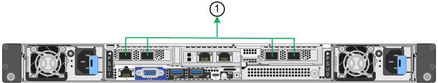

= 端口绑定模式(SGF6112)
:allow-uri-read: 
:icons: font
:imagesdir: ../media/

[role="lead"]
时间 link:configuring-network-links.html["正在配置网络链路"] 对于SGF6112设备、您可以对连接到网格网络和可选客户端网络的端口以及连接到可选管理网络的1/10-GbE管理端口使用端口绑定。端口绑定可在 StorageGRID 网络和设备之间提供冗余路径，从而有助于保护数据。

== 网络绑定模式

对于网格网络和客户端网络连接、设备上的网络端口支持固定端口绑定模式或聚合端口绑定模式。

=== 固定端口绑定模式

固定端口绑定模式是网络端口的默认配置。

image::../media/sgf6112_fixed_port.png[GF6112固定端口绑定模式]

[cols="1a,3a"]
|===
| Callout | 哪些端口已绑定 

 a| 
C
 a| 
如果使用此网络，则端口 1 和 3 将绑定到客户端网络。

 a| 
g
 a| 
网格网络的端口 2 和 4 绑定在一起。

|===
使用固定端口绑定模式时，可以使用主动备份模式或链路聚合控制协议模式（ LACP 802.3ad ）绑定端口。

* 在主动备份模式（默认）下，一次只有一个端口处于活动状态。如果活动端口发生故障，其备份端口会自动提供故障转移连接。端口 4 为端口 2 （网格网络）提供备份路径，端口 3 为端口 1 （客户端网络）提供备份路径。
* 在LACP模式下、每对端口都会在设备和网络之间形成一个逻辑通道、从而提高吞吐量。如果一个端口发生故障，另一个端口将继续提供通道。吞吐量会降低，但连接不会受到影响。

NOTE: 如果不需要冗余连接、则每个网络只能使用一个端口。但是、请注意、安装StorageGRID 后、可能会在网格管理器中触发*存储设备链路断开*警报、指示缆线已拔下。您可以安全地禁用此警报规则。

=== 聚合端口绑定模式

聚合端口绑定模式可显著提高每个 StorageGRID 网络的吞吐量，并提供额外的故障转移路径。

[cols="1a,3a"]
|===
| Callout | 哪些端口已绑定 

 a| 
1.
 a| 
所有连接的端口都分组在一个 LACP 绑定中，从而允许所有端口用于网格网络和客户端网络流量。

|===
如果您计划使用聚合端口绑定模式：

* 您必须使用 LACP 网络绑定模式。
* 您必须为每个网络指定唯一的 VLAN 标记。此 VLAN 标记将添加到每个网络数据包中，以确保网络流量路由到正确的网络。
* 这些端口必须连接到可支持 VLAN 和 LACP 的交换机。如果多个交换机参与 LACP 绑定，则这些交换机必须支持多机箱链路聚合组（ MLAG ）或等效项。
* 您了解如何将交换机配置为使用VLAN、LACP和MAG或等效设备。

如果不想使用所有四个端口、可以使用一个、两个或三个端口。使用多个端口可以最大程度地提高在其中一个端口出现故障时某些网络连接仍可用的可能性。

NOTE: 如果您选择使用的网络端口少于四个，请注意，在安装设备节点后，可能会在网格管理器中触发 * 服务设备链路已关闭 * 警报，指示已拔下缆线。您可以安全地为触发的警报禁用此警报规则。

== 管理端口的网络绑定模式

对于两个1/10-GbE管理端口、您可以选择独立网络绑定模式或Active-Backup网络绑定模式以连接到可选的管理网络。

image::../media/sgf6112_bonded_management_ports.png[网络管理端口]

在独立模式下，只有左侧的管理端口连接到管理网络。此模式不提供冗余路径。右侧的管理端口未连接、可用于临时本地连接(使用IP地址169.254..1)。

在主动备份模式下，两个管理端口均连接到管理网络。一次只有一个端口处于活动状态。如果活动端口发生故障，其备份端口会自动提供故障转移连接。将这两个物理端口绑定到一个逻辑管理端口可提供指向管理网络的冗余路径。

NOTE: 在将1/10-GbE管理端口配置为主动-备份模式时、如果需要临时本地连接到设备、请从两个管理端口上拔下缆线、将临时缆线插入右侧的管理端口、然后使用IP地址169.254..1访问设备。

[cols="1a,3a"]
|===
| Callout | 网络绑定模式 

 a| 
答
 a| 
主动备份模式。这两个管理端口都绑定到一个连接到管理网络的逻辑管理端口。

 a| 
I
 a| 
独立模式。左侧端口连接到管理网络。右侧端口可用于临时本地连接（ IP 地址 169.254.0.1 ）。

|===