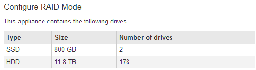

= 对连接问题进行故障排除(SG6000或SG5700)
:allow-uri-read: 
:icons: font
:imagesdir: ../media/

[role="lead"]
如果您在 StorageGRID 设备安装期间遇到连接问题，应执行列出的更正操作步骤。

== 无法连接到SG6000设备

如果无法连接到设备、则可能存在网络问题描述 、或者硬件安装可能未成功完成。

.步骤
. 如果无法连接到 SANtricity 系统管理器：
+
.. 尝试使用管理网络上任一存储控制器的IP地址对SANtricity System Manager执行ping操作：+
`*ping _Storage_Controller_IP_*`
.. 如果 ping 未收到任何响应，请确认您使用的 IP 地址正确无误。
+
使用任一存储控制器上的管理端口 1 的 IP 地址。

.. 如果 IP 地址正确，请检查设备布线和网络设置。
+
如果无法解决问题描述 问题，请联系技术支持。

.. 如果 ping 成功，请打开 Web 浏览器。
.. 输入SANtricity 系统管理器的URL：+
`*https://_Storage_Controller_IP_*`
+
此时将显示 SANtricity 系统管理器的登录页面。

. 如果无法连接到 SG6000-CN 控制器：
+
.. 尝试使用SG6000-CN控制器的IP地址对设备执行ping操作：+
`*ping _SG6000-CN_Controller_IP_*`
.. 如果 ping 未收到任何响应，请确认您使用的 IP 地址正确无误。
+
您可以使用网格网络，管理网络或客户端网络上设备的 IP 地址。

.. 如果 IP 地址正确，请检查设备布线， SFP 收发器和网络设置。
.. 如果可以物理访问SG6000-CN、则可以直接连接到永久链路本地IP `169.254.0.1` 检查控制器网络配置并根据需要进行更新。有关详细说明，请参见中的步骤 2 link:accessing-storagegrid-appliance-installer.html["访问 StorageGRID 设备安装程序"]。
+
如果无法解决问题描述 问题，请联系技术支持。

.. 如果 ping 成功，请打开 Web 浏览器。
.. 输入StorageGRID 设备安装程序的URL：+
`*https://_SG6000-CN_Controller_IP_:8443*`
+
此时将显示主页页面。

== SG6060扩展架未显示在设备安装程序中

如果您已为SG6060安装了扩展架、但它们未显示在StorageGRID 设备安装程序中、则应验证这些扩展架是否已完全安装并打开电源。

.关于此任务
您可以通过在 StorageGRID 设备安装程序中查看以下信息来验证扩展架是否已连接到设备：

* 主页 * 页面包含一条有关扩展架的消息。
+
image::../media/expansion_shelf_home_page_msg.png[扩展架消息]

* * 高级 * > * RAID 模式 * 页面可通过驱动器数量指示设备是否包含扩展架。例如，在以下屏幕截图中，显示了两个 SSD 和 178 个 HDD 。包含两个扩展架的 SG6060 总共包含 180 个驱动器。

如果StorageGRID 设备安装程序页面未指示存在扩展架、请遵循此操作步骤。

.步骤
. 确认所有所需的缆线均已牢固连接。请参见 link:cabling-appliance-sg6000.html["缆线设备（ SG6000 ）"]。
. 验证是否已打开扩展架的电源。请参见 link:connecting-power-cords-and-applying-power-sg6000.html["连接电源线并接通电源（ SG6000 ）"]。
. 如果您需要有关解决问题描述 的帮助，请联系技术支持。

== 无法连接到SG5700设备

如果无法连接到设备、则可能存在网络问题描述 、或者硬件安装可能未成功完成。

.步骤
. 如果无法连接到 SANtricity 系统管理器：
+
.. 尝试使用SANtricity System Manager管理网络上E2800控制器的IP地址对设备执行Ping操作：+
`*ping _E2800_Controller_IP_*`
.. 如果 ping 未收到任何响应，请确认您使用的 IP 地址正确无误。
+
使用 E2800 控制器上管理端口 1 的 IP 地址。

.. 如果 IP 地址正确，请检查设备布线和网络设置。
+
如果无法解决问题描述 问题，请联系技术支持。

.. 如果 ping 成功，请打开 Web 浏览器。
.. 输入SANtricity 系统管理器的URL：+
`*https://_E2800_Controller_IP_*`
+
此时将显示 SANtricity 系统管理器的登录页面。

. 如果无法连接到 E5700SG 控制器：
+
.. 尝试使用E5700SG控制器的IP地址对设备执行ping操作：+
`*ping _E5700SG_Controller_IP_*`
.. 如果 ping 未收到任何响应，请确认您使用的 IP 地址正确无误。
+
您可以使用网格网络，管理网络或客户端网络上设备的 IP 地址。

.. 如果 IP 地址正确，请检查设备布线， SFP 收发器和网络设置。
+
如果无法解决问题描述 问题，请联系技术支持。

.. 如果 ping 成功，请打开 Web 浏览器。
.. 输入StorageGRID 设备安装程序的URL：+
`*https://_E5700SG_Controller_IP_:8443*`
+
此时将显示主页页面。

.相关信息
link:../installconfig/viewing-status-indicators.html["查看状态指示器"]
