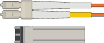

= 打开包装箱
:allow-uri-read: 
:icons: font
:imagesdir: ../media/

[role="lead"]
安装StorageGRID 设备之前，请打开所有包装箱的包装并将物品与装箱单上的物品进行比较。

== GF6112设备

=== 硬件

[cols="1a,4a"]
|===
| 项目 | 外观 

 a| 
GF6112
 a| 
image::../media/sg6000_cn_front_without_bezel.gif[前端驱动器GF6112设备]

 a| 
带说明的导轨套件
 a| 
image::../media/rail_kit.gif[导轨套件]

 a| 
前挡板
 a| 
image::../media/sgf_6112_front_bezel.png[前挡板]

|===

=== 电源线

GF6112设备的发货包括以下电源线。

TIP: 您的机柜可能使用专用电源线，而不是设备随附的电源线。

[cols="1a,4a"]
|===
| 项目 | 外观 

 a| 
您所在国家/地区的两条电源线
 a| 
image::../media/power_cords.gif[电源线]

|===

== SG6000设备

=== SG6060硬件

[cols="1a,4a"]
|===
| 项目 | 外观 

 a| 
SG6000-CN 控制器
 a| 
image::../media/sg6000_cn_front_without_bezel.gif[SG6000-CN 控制器]

 a| 
E2860控制器架、未安装驱动器
 a| 
image::../media/de460c_table_size.gif[SG5760 4U 设备]

 a| 
两个前挡板
 a| 
image::../media/sg6000_front_bezels_for_table.gif[前挡板]

 a| 
两个导轨套件、带说明
 a| 
image::../media/rail_kit.gif[导轨套件]

 a| 
60个驱动器(2个SSD和58个NL)
 a| 
image::../media/sg5760_drive.gif[驱动器]

 a| 
四个手柄
 a| 
image::../media/handles.gif[SG5760 句柄]

 a| 
用于方孔机架安装的后支架和固定螺母
 a| 
image::../media/back_brackets_table_size.gif[SG5760 的背面支架和锁紧螺母]

|===

=== SG6060 扩展架

[cols="1a,4a"]
|===
| 项目 | 外观 

 a| 
扩展架未安装驱动器
 a| 
image::../media/de460c_table_size.gif[SG5760 4U 设备]

 a| 
前挡板
 a| 
image::../media/front_bezel_for_table_de460c.gif[前挡板 DE460C]

 a| 
60 个 NL-SAS 驱动器
 a| 
image::../media/sg5760_drive.gif[驱动器]

 a| 
一个带说明的导轨套件
 a| 
image::../media/rail_kit.gif[导轨套件]

 a| 
四个手柄
 a| 
image::../media/handles.gif[SG5760 句柄]

 a| 
用于方孔机架安装的后支架和固定螺母
 a| 
image::../media/back_brackets_table_size.gif[SG5760 的背面支架和锁紧螺母]

|===

=== GF6024硬件

[cols="1a,4a"]
|===
| 项目 | 外观 

 a| 
SG6000-CN 控制器
 a| 
image::../media/sg6000_cn_front_without_bezel.gif[SG6000-CN 控制器]

 a| 
安装了24个固态(闪存)驱动器的EF570闪存阵列
 a| 
image::../media/de224c_with_drives.gif[EF570 控制器架]

 a| 
两个前挡板
 a| 
image::../media/sgf6024_front_bezels_for_table.png[SG6024 前挡板]

 a| 
两个导轨套件、带说明
 a| 
image::../media/rail_kit.gif[导轨套件]

 a| 
磁盘架端盖
 a| 
image::../media/endcaps.png[端盖]

|===

=== 缆线和连接器

SG6000设备附带了以下缆线和连接器。

TIP: 您的机柜可能使用专用电源线，而不是设备随附的电源线。

[cols="1a,4a"]
|===
| 项目 | 外观 

 a| 
您所在国家/地区的四根电源线
 a| 
image::../media/power_cords.gif[电源线]

 a| 
光缆和SFP收发器
 a| 

* 用于 FC 互连端口的四根光缆
* 四个 SFP+ 收发器，支持 16 Gb/ 秒 FC

 a| 
可选：两根SAS缆线、用于连接每个SG6060扩展架
 a| 
image::../media/sas_cable.gif[SAS 缆线]

|===

== SG5700设备

=== 硬件

[cols="1a,4a"]
|===
| 项目 | 外观 

 a| 
安装了12个驱动器的SG5712设备
 a| 
image::../media/de212c_table_size.gif[SG5712 2U 设备]

 a| 
SG5760设备、但未安装驱动器
 a| 
image::../media/de460c_table_size.gif[SG5760 4U 设备]

 a| 
产品前挡板
 a| 
image::../media/sg5700_front_bezels.gif[SG5712 和 SG5760 的挡板]

 a| 
带说明的导轨套件
 a| 
image::../media/rail_kit.gif[导轨套件]

 a| 
SG5760：60个驱动器
 a| 
image::../media/sg5760_drive.gif[驱动器]

 a| 
SG5760：句柄
 a| 
image::../media/handles.gif[SG5760 句柄]

 a| 
SG5760：用于方孔机架安装的后支架和固定螺帽
 a| 
image::../media/back_brackets_table_size.gif[SG5760 的背面支架和锁紧螺母]

|===

=== 缆线和连接器

SG5700设备附带了以下缆线和连接器。

TIP: 您的机柜可能使用专用电源线，而不是设备随附的电源线。

[cols="1a,4a"]
|===
| 项目 | 外观 

 a| 
您所在国家/地区的两条电源线
 a| 
image::../media/power_cords.gif[电源线]

 a| 
光缆和SFP收发器
 a| 

* 用于 FC 互连端口的两根光缆
* 八个 SFP+ 收发器，与四个 16Gb/s FC 互连端口和四个 10-GbE 网络端口兼容

|===

== SG100和SG1000设备

=== 硬件

[cols="1a,4a"]
|===
| 项目 | 外观 

 a| 
SG100或SG1000
 a| 
image::../media/sg6000_cn_front_without_bezel.gif[正面驱动器 SG 100 或 SG1000 服务设备]

 a| 
带说明的导轨套件
 a| 
image::../media/rail_kit.gif[导轨套件]

|===

=== 电源线

SG100或SG1000设备的发货包括以下电源线。

TIP: 您的机柜可能使用专用电源线，而不是设备随附的电源线。

[cols="1a,4a"]
|===
| 项目 | 外观 

 a| 
您所在国家/地区的两条电源线
 a| 
image::../media/power_cords.gif[电源线]

|===