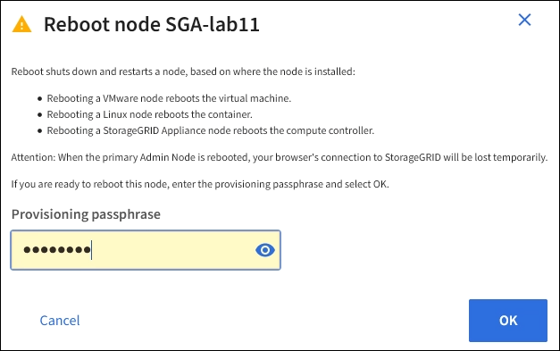

= 从网格管理器重新启动网格节点
:allow-uri-read: 
:icons: font
:imagesdir: ../media/

[role="lead"]
从网格管理器重新启动网格节点会发出 `reboot` 命令。

.开始之前
* 您将使用登录到网格管理器 link:../admin/web-browser-requirements.html["支持的 Web 浏览器"]。
* 您具有维护或 root 访问权限。
* 您具有配置密码短语。

.步骤
. 选择 * 节点 * 。
. 选择要重新启动的网格节点。
. 选择 * 任务 * 选项卡。
+
image::../media/maintenance_mode.png[节点 > 任务 > 重新启动按钮]

. 选择 * 重新启动 * 。
+
此时将显示确认对话框。

+

+

NOTE: 如果要重新启动主管理节点，则确认对话框会提醒您，服务停止后，浏览器与网格管理器的连接将暂时断开。

. 输入配置密码短语，然后选择 * 确定 * 。
. 等待节点重新启动。
+
关闭服务可能需要一些时间。

+
节点重新启动时， * 节点 * 页面左侧会显示灰色图标（管理员关闭）。当所有服务重新启动且节点已成功连接到网格时， * 节点 * 页面应显示正常状态（节点名称左侧没有图标），表示没有活动警报且节点已连接到网格。

