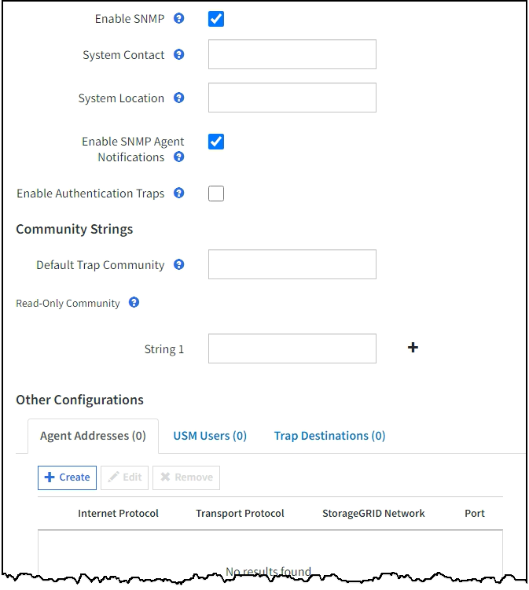

= 配置 SNMP 代理
:allow-uri-read: 
:icons: font
:imagesdir: ../media/

[role="lead"]
如果要使用第三方 SNMP 管理系统进行只读 MIB 访问和通知，则可以配置 StorageGRID SNMP 代理。

.开始之前
* 您将使用登录到网格管理器 link:../admin/web-browser-requirements.html["支持的 Web 浏览器"]。
* 您具有 root 访问权限。

.关于此任务
StorageGRID SNMP 代理支持所有三个版本的 SNMP 协议。您可以为代理配置一个或多个版本。

.步骤
. 选择 * 配置 * > * 监控 * > * SNMP 代理 * 。
+
此时将显示 SNMP 代理页面。

+
image::../media/snmp_agent_not_enabled.png[SNMP 代理未启用]

. 要在所有网格节点上启用SNMP代理，请选中*Enable SNMP*复选框。
+
此时将显示用于配置 SNMP 代理的字段。

+

. 在 * 系统联系人 * 字段中，输入希望 StorageGRID 在 sysContact 的 SNMP 消息中提供的值。
+
系统联系人通常是电子邮件地址。您为 StorageGRID 系统中的所有节点提供的适用场景 值。* 系统联系人 * 最多可以包含 255 个字符。

. 在 * 系统位置 * 字段中，输入希望 StorageGRID 在 "SNMP messages"sysLocation" 中提供的值。
+
系统位置可以是有助于确定 StorageGRID 系统位置的任何信息。例如，您可以使用设施的街道地址。您为 StorageGRID 系统中的所有节点提供的适用场景 值。* 系统位置 * 最多可以包含 255 个字符。

. 如果希望StorageGRID SNMP代理发送陷阱和通知通知，请保持选中*启用SNMP代理通知*复选框。
+
如果清除此复选框、则SNMP代理支持只读MIB访问、但不会发送任何SNMP通知。

. 如果希望StorageGRID SNMP代理在收到未经正确身份验证的协议消息时发送身份验证陷阱，请选中*启用身份验证陷阱*复选框。
. 如果使用 SNMPv1 或 SNMPv2c ，请完成社区字符串部分。
+
本节中的字段用于 SNMPv1 或 SNMPv2c 中基于社区的身份验证。这些字段不适用于SNMPv3。

+
.. 在 * 默认陷阱社区 * 字段中，也可以输入要用于陷阱目标的默认社区字符串。
+
您可以根据需要提供其他（ "`custom` " ）社区字符串 <<select_trap_destination,定义特定陷阱目标>>。

+
*默认陷阱社区*最多可以包含32个字符、不能包含空格字符。

.. 对于 * 只读社区 * ，输入一个或多个社区字符串以允许对 IPv4 和 IPv6 代理地址进行只读 MIB 访问。选择加号 image:../media/icon_plus_sign_black_on_white_old.png["加号"] 添加多个字符串。
+
当管理系统查询 StorageGRID MIB 时，它会发送一个社区字符串。如果社区字符串与此处指定的值之一匹配，则 SNMP 代理会向管理系统发送响应。

+
每个社区字符串最多可以包含32个字符、并且不能包含空格字符。最多允许五个字符串。

+

NOTE: 为确保StorageGRID 系统的安全性、请勿使用"`public`"作为社区字符串。如果不输入社区字符串、SNMP代理将使用StorageGRID 系统的网格ID作为社区字符串。

. 也可以选择其他配置部分中的代理地址选项卡。
+
使用此选项卡指定一个或多个 "`侦听地址。` " 这些是 SNMP 代理可以接收查询的 StorageGRID 地址。每个代理地址都包括一个 Internet 协议，一个传输协议，一个 StorageGRID 网络以及一个端口（可选）。

+
如果不配置代理地址、则所有StorageGRID 网络上的默认侦听地址均为UDP端口161。

+
.. 选择 * 创建 * 。
+
此时将显示创建代理地址对话框。

+
image::../media/snmp_create_agent_address.png[SNMP 代理地址]

.. 对于 * 互联网协议 * ，选择此地址是使用 IPv4 还是 IPv6 。
+
默认情况下， SNMP 使用 IPv4 。

.. 对于 * 传输协议 * ，选择此地址是使用 UDP 还是 TCP 。
+
默认情况下， SNMP 使用 UDP 。

.. 在 * StorageGRID Network* 字段中，选择要接收查询的 StorageGRID 网络。
+
*** 网格，管理和客户端网络： StorageGRID 应侦听所有三个网络上的 SNMP 查询。
*** 网格网络
*** 管理网络
*** 客户端网络
+

NOTE: 要确保客户端与 StorageGRID 的通信保持安全，不应为此客户端网络创建代理地址。

.. 在 * 端口 * 字段中，也可以输入 SNMP 代理应侦听的端口号。
+
SNMP 代理的默认 UDP 端口为 161 ，但您可以输入任何未使用的端口号。

+

NOTE: 保存 SNMP 代理时， StorageGRID 会自动打开内部防火墙上的代理地址端口。您必须确保任何外部防火墙允许访问这些端口。

.. 选择 * 创建 * 。
+
此时将创建代理地址并将其添加到表中。

+
image::../media/snmp_other_configurations_agent_addresses_table.png[SNMP 其他配置代理地址表]

. 如果您使用的是 SNMPv3 ，请在其他配置部分中选择 USM 用户选项卡。
+
使用此选项卡可定义有权查询 MIB 或接收陷阱并通知的 USM 用户。

+

NOTE: 如果您仅使用 SNMPv1 或 SNMPv2c ，则此步骤不适用。

+
.. 选择 * 创建 * 。
+
此时将显示创建 USM 用户对话框。

+
image::../media/snmp_create_usm_user.png[SNMP USM 用户]

.. 为此 USM 用户输入唯一的 * 用户名 * 。
+
用户名最多包含32个字符、不能包含空格字符。创建用户后、无法更改此用户名。

.. 如果此用户对MIB具有只读访问权限，请选中*只读MIB访问*复选框。
+
如果选择 * 只读 MIB 访问 * ，则会禁用 * 权威引擎 ID* 字段。

+

NOTE: 具有只读MIB访问权限的USM用户不能具有引擎ID。

.. 如果要在通知目标中使用此用户，请为此用户输入 * 权威引擎 ID* 。
+

NOTE: SNMPv3 INFORM 目标必须具有具有引擎 ID 的用户。SNMPv3陷阱目标不能包含具有引擎ID的用户。

+
权威引擎 ID 可以是 5 到 32 字节，以十六进制表示。

.. 为 USM 用户选择一个安全级别。
+
*** * authPriv* ：此用户与身份验证和隐私（加密）通信。您必须指定身份验证协议和密码以及隐私协议和密码。
*** * authNoPriv* ：此用户使用身份验证进行通信，并且没有隐私（无加密）。您必须指定身份验证协议和密码。

.. 输入并确认此用户将用于身份验证的密码。
+

NOTE: 唯一支持的身份验证协议是 SHA （ HMAC-SHA-96 ）。

.. 如果您选择了 * 身份验证基础 * ，请输入并确认此用户将用于隐私保护的密码。
+

NOTE: 唯一支持的隐私协议是 AES 。

.. 选择 * 创建 * 。
+
此时将创建 USM 用户并将其添加到表中。

+
image::../media/snmp_other_config_usm_users_table.png[SNMP 其他配置 USM 用户表]

. 在其他配置部分中，选择陷阱目标选项卡。
+
通过陷阱目标选项卡，您可以为 StorageGRID 陷阱或通知通知定义一个或多个目标。启用SNMP代理并选择*保存*后，StorageGRID 将开始向每个定义的目标发送通知。触发警报时会发送通知。此外，还会为受支持的 MIB-II 实体（例如 ifdown 和 coldstart ）发送标准通知。

+
.. 选择 * 创建 * 。
+
此时将显示创建陷阱目标对话框。

+
image::../media/snmp_create_trap_destination.png[SNMP 创建陷阱目标]

.. 在 * 版本 * 字段中，选择要用于此通知的 SNMP 版本。
.. 根据您选择的版本填写此表单
+
[cols="1a,2a"]
|===
| version | 指定此信息 

 a| 
SNMPv1

(对于SNMPv1、SNMP代理只能发送陷阱。不支持通知。)
 a| 
... 在 * 主机 * 字段中，输入要接收陷阱的 IPv4 或 IPv6 地址（或 FQDN ）。
... 对于 * 端口 * ，请使用默认值（ 162 ），除非必须使用其他值。（ 162 是 SNMP 陷阱的标准端口。）
... 对于 * 协议 * ，请使用默认值（ UDP ）。此外，还支持 TCP 。（ UDP 是标准 SNMP 陷阱协议。）
... 如果在 SNMP 代理页面上指定了一个陷阱团体，请使用默认陷阱团体，或者为此陷阱目标输入自定义社区字符串。
+
自定义社区字符串最多可以包含32个字符、并且不能包含空格。

 a| 
SNMPv2c
 a| 
... 选择目标是用于陷阱还是用于通知。
... 在 * 主机 * 字段中，输入要接收陷阱的 IPv4 或 IPv6 地址（或 FQDN ）。
... 对于 * 端口 * ，请使用默认值（ 162 ），除非必须使用其他值。（ 162 是 SNMP 陷阱的标准端口。）
... 对于 * 协议 * ，请使用默认值（ UDP ）。此外，还支持 TCP 。（ UDP 是标准 SNMP 陷阱协议。）
... 如果在 SNMP 代理页面上指定了一个陷阱团体，请使用默认陷阱团体，或者为此陷阱目标输入自定义社区字符串。
+
自定义社区字符串最多可以包含32个字符、并且不能包含空格。

 a| 
SNMPv3
 a| 
... 选择目标是用于陷阱还是用于通知。
... 在 * 主机 * 字段中，输入要接收陷阱的 IPv4 或 IPv6 地址（或 FQDN ）。
... 对于 * 端口 * ，请使用默认值（ 162 ），除非必须使用其他值。（ 162 是 SNMP 陷阱的标准端口。）
... 对于 * 协议 * ，请使用默认值（ UDP ）。此外，还支持 TCP 。（ UDP 是标准 SNMP 陷阱协议。）
... 选择要用于身份验证的 USM 用户。
+
**** 如果选择了 * 陷阱 * ，则仅显示不具有权威引擎 ID 的 USM 用户。
**** 如果选择 * 通知 * ，则仅显示具有权威引擎 ID 的 USM 用户。

|===
.. 选择 * 创建 * 。
+
此时将创建陷阱目标并将其添加到表中。

. 完成SNMP代理配置后，选择*Save*。
+
新的 SNMP 代理配置将变为活动状态。

.相关信息
link:silencing-alert-notifications.html["静默警报通知"]
