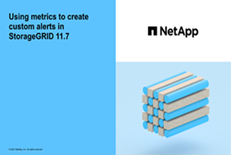

= 管理警报：概述
:allow-uri-read: 
:icons: font
:imagesdir: ../media/

[role="lead"]
警报系统提供了一个易于使用的界面，用于检测，评估和解决 StorageGRID 运行期间可能发生的问题。

您可以创建自定义警报、编辑或禁用警报以及管理警报通知。

了解更多信息：

* 观看视频： https://netapp.hosted.panopto.com/Panopto/Pages/Viewer.aspx?id=18df5a3d-bf19-4a9e-8922-afbd009b141b["视频：StorageGRID 11.7的警报概述"^]
+
[link=https://netapp.hosted.panopto.com/Panopto/Pages/Viewer.aspx?id=18df5a3d-bf19-4a9e-8922-afbd009b141b]
image::../media/video-screenshot-alert-overview-117.png[视频：StorageGRID 11.7的警报概述]

* 观看视频： https://netapp.hosted.panopto.com/Panopto/Pages/Viewer.aspx?id=61acb7ba-7683-488a-a689-afb7010088f3["视频：在StorageGRID 11.7中使用指标创建自定义警报"^]
+
[link=https://netapp.hosted.panopto.com/Panopto/Pages/Viewer.aspx?id=61acb7ba-7683-488a-a689-afb7010088f3]

* 请参见 link:alerts-reference.html["警报参考"]。

