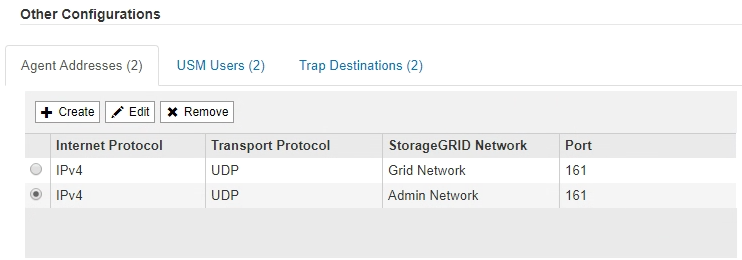

= 更新 SNMP 代理
:allow-uri-read: 
:icons: font
:imagesdir: ../media/

[role="lead"]
您可能需要禁用 SNMP 通知，更新社区字符串，或者添加或删除代理地址， USM 用户和陷阱目标。

.开始之前
* 您必须使用登录到网格管理器 link:../admin/web-browser-requirements.html["支持的 Web 浏览器"]。
* 您必须具有root访问权限。

.关于此任务
更新时 link:configuring-snmp-agent.html["SNMP 代理配置"]请注意，必须选择SNMP代理页面底部的*Save*以提交对每个选项卡所做的任何更改。

.步骤
. 选择 * 配置 * > * 监控 * > * SNMP 代理 * 。
+
此时将显示 SNMP 代理页面。

. 如果要在所有网格节点上禁用SNMP代理，请清除*Enable SNMP*复选框，然后选择*Save*。
+
已对所有网格节点禁用 SNMP 代理。如果稍后重新启用代理，则会保留先前的任何 SNMP 配置设置。

. 或者，更新您为 * 系统联系人 * 和 * 系统位置 * 输入的值。
. (可选)如果不再希望StorageGRID SNMP代理发送陷阱和通知，请清除*Enable SNMP Agent Notification (启用SNMP代理通知)*复选框。
+
清除此复选框后、SNMP代理支持只读MIB访问、但不会发送任何SNMP通知。

. 或者，如果您不再希望StorageGRID SNMP代理在收到未经正确身份验证的协议消息时发送身份验证陷阱，请清除*启用身份验证陷阱*复选框。
. 如果您使用 SNMPv1 或 SNMPv2c ，也可以更新社区字符串部分。
+
本节中的字段用于 SNMPv1 或 SNMPv2c 中基于社区的身份验证。这些字段不适用于SNMPv3。

+

NOTE: 如果要删除默认社区字符串，必须首先确保所有陷阱目标都使用自定义社区字符串。

. 如果要更新代理地址，请选择其他配置部分中的代理地址选项卡。
+

+
使用此选项卡指定一个或多个 "`侦听地址。` " 这些是 SNMP 代理可以接收查询的 StorageGRID 地址。每个代理地址都包括一个 Internet 协议，一个传输协议，一个 StorageGRID 网络和一个端口。

+
.. 要增加业务代表地址，请选择*Cree*。然后，请参见有关配置 SNMP 代理的说明中的代理地址步骤。
.. 要编辑业务代表地址，请选择该地址的单选按钮，然后选择*Edit*。然后，请参见有关配置 SNMP 代理的说明中的代理地址步骤。
.. 要删除业务代表地址，请选择该地址的单选按钮，然后选择*Remove*。然后，选择*OK*确认要删除此地址。
.. 要提交更改，请选择SNMP代理页面底部的*保存*。

. 如果要更新 USM 用户，请在其他配置部分中选择 USM 用户选项卡。
+
image::../media/snmp_other_config_usm_users_table.png[SNMP 其他配置 USM 用户表]

+
使用此选项卡可定义有权查询 MIB 或接收陷阱并通知的 USM 用户。

+
.. 要添加USM用户，请选择*Cree*。然后，请参见配置 SNMP 代理的说明中适用于 USM 用户的步骤。
.. 要编辑USM用户，请选择该用户的单选按钮，然后选择*Edit*。然后，请参见配置 SNMP 代理的说明中适用于 USM 用户的步骤。
+
无法更改现有USM用户的用户名。如果需要更改用户名，必须删除此用户并创建新用户名。

+

NOTE: 如果您添加或删除用户的权威引擎 ID ，并且当前已选择该用户作为目标，则必须按照步骤中所述编辑或删除该目标 <<SNMP_TRAP_DESTINATION,SNMP 陷阱目标>>。否则，在保存 SNMP 代理配置时会发生验证错误。

.. 要删除USM用户，请选择该用户的单选按钮，然后选择*Remove*。然后，选择*OK*确认要删除此用户。
+

NOTE: 如果当前已为陷阱目标选择删除的用户，则必须按照步骤中所述编辑或删除此目标 <<SNMP_TRAP_DESTINATION,SNMP 陷阱目标>>。否则，在保存 SNMP 代理配置时会发生验证错误。

.. 要提交更改，请选择SNMP代理页面底部的*保存*。

. 【 SNMP 陷阱目标， start=9]] 如果要更新陷阱目标，请选择其他配置部分中的陷阱目标选项卡。
+
通过陷阱目标选项卡，您可以为 StorageGRID 陷阱或通知通知定义一个或多个目标。启用SNMP代理并选择*保存*后，StorageGRID 将开始向每个定义的目标发送通知。触发警报和警报时会发送通知。此外，还会为受支持的 MIB-II 实体（例如 ifdown 和 coldstart ）发送标准通知。

+
.. 要添加陷阱目标，请选择*Cree*。然后，请参见配置 SNMP 代理的说明中有关陷阱目标的步骤。
.. 要编辑陷阱目标，请选择用户的单选按钮，然后选择*Edit*。然后，请参见配置 SNMP 代理的说明中有关陷阱目标的步骤。
.. 要删除陷阱目标，请选择目标对应的单选按钮，然后选择*Remove*。然后，选择*OK*确认要删除此目标。
.. 要提交更改，请选择SNMP代理页面底部的*保存*。

. 更新SNMP代理配置后，选择*Save*。

