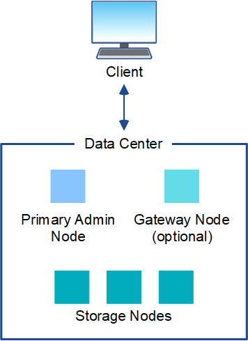

= StorageGRID 架构和网络拓扑
:allow-uri-read: 
:icons: font
:imagesdir: ../media/

[role="lead"]
StorageGRID 系统由一个或多个数据中心站点上的多种类型的网格节点组成。

有关追加信息 关于 StorageGRID 网络拓扑，要求和网格通信的信息，请参见 link:../network/index.html["网络连接准则"]。

== 部署拓扑

StorageGRID 系统可以部署到一个数据中心站点或多个数据中心站点。

=== 单个站点

在使用单个站点的部署中， StorageGRID 系统的基础架构和操作会集中进行。

=== 多个站点

在包含多个站点的部署中，可以在每个站点安装不同类型和数量的 StorageGRID 资源。例如，一个数据中心可能需要比另一个数据中心更多的存储。

不同站点通常位于不同故障域中不同地理位置的不同位置，例如地震故障线或泛洪。数据共享和灾难恢复可通过自动将数据分发到其他站点来实现。

image::../media/data_center_sites_multiple.png[多个数据中心站点]

一个数据中心中也可以存在多个逻辑站点，以便使用分布式复制和纠删编码来提高可用性和故障恢复能力。

=== 网格节点冗余

在单站点或多站点部署中，您可以选择包含多个管理节点或网关节点以实现冗余。例如，您可以在一个站点或多个站点上安装多个管理节点。但是，每个 StorageGRID 系统只能有一个主管理节点。

== 系统架构

此图显示了网格节点在 StorageGRID 系统中的排列方式。

image::../media/grid_nodes_and_components.png[周围文字所述的示意图]

S3 和 Swift 客户端在 StorageGRID 中存储和检索对象。其他客户端用于发送电子邮件通知，访问 StorageGRID 管理界面以及访问审核共享（可选）。

S3 和 Swift 客户端可以连接到网关节点或管理节点，以使用存储节点的负载平衡接口。或者， S3 和 Swift 客户端也可以使用 HTTPS 直接连接到存储节点。

对象可以存储在基于软件或硬件的存储节点上的StorageGRID 中、也可以存储在由外部S3存储分段或Azure Blb存储容器组成的云存储池中。

== 网格节点和服务

StorageGRID 系统的基本组件是网格节点。节点包含服务，这些服务是为网格节点提供一组功能的软件模块。

StorageGRID 系统使用四种类型的网格节点：

* * 管理节点 * 提供系统配置，监控和日志记录等管理服务。登录到网格管理器后，您将连接到管理节点。每个网格都必须有一个主管理节点，并且可能有额外的非主管理节点，以实现冗余。您可以连接到任何管理节点，每个管理节点都会显示一个类似的 StorageGRID 系统视图。但是，必须使用主管理节点执行维护过程。
+
管理节点还可用于对 S3 和 Swift 客户端流量进行负载平衡。

* * 存储节点 * 用于管理和存储对象数据和元数据。每个 StorageGRID 系统必须至少具有三个存储节点。如果您有多个站点，则 StorageGRID 系统中的每个站点也必须有三个存储节点。
* * 网关节点（可选） * 提供了一个负载平衡接口，客户端应用程序可以使用该接口连接到 StorageGRID 。负载平衡器可将客户端无缝定向到最佳存储节点，以便节点甚至整个站点的故障是透明的。您可以组合使用网关节点和管理节点进行负载平衡，也可以实施第三方 HTTP 负载平衡器。
* *归档节点(已弃用)*提供了一个可选接口，通过该接口可以将对象数据归档到磁带。

要了解更多信息，请参见 link:../admin/index.html["管理 StorageGRID"]。

=== 基于软件的节点

基于软件的网格节点可以通过以下方式进行部署：

* 作为 VMware vSphere 中的虚拟机（ VM ）
* 在 Linux 主机上的容器引擎中。支持以下操作系统：
+
** Red Hat Enterprise Linux
** CentOS
** Ubuntu
** Debian

有关详细信息，请参见以下内容：

* link:../vmware/index.html["安装 VMware"]
* link:../rhel/index.html["安装 Red Hat Enterprise Linux 或 CentOS"]
* link:../ubuntu/index.html["安装 Ubuntu 或 Debian"]

使用 https://["NetApp 互操作性表工具（ IMT ）"^] 以获取支持的版本列表。

=== StorageGRID 设备节点

StorageGRID 硬件设备经过专门设计，可在 StorageGRID 系统中使用。某些设备可用作存储节点。其他设备可以用作管理节点或网关节点。您可以将设备节点与基于软件的节点结合使用，也可以部署完全设计的全设备网格，这些网格不依赖于外部虚拟机管理程序，存储或计算硬件。

可以使用以下类型的StorageGRID 设备：

* SGF6112存储设备*是一款全闪存单机架单元(1U)服务器、采用12个NVMe (非易失性内存高速) SSD驱动器以及集成的计算和存储控制器。
* * SG100 和 SG1000 服务设备 * 是一个单机架单元（ 1U ）服务器，每个服务器均可作为主管理节点，非主管理节点或网关节点运行。这两个设备可以同时作为网关节点和管理节点（主节点和非主节点）运行。
* * SG6000 存储设备 * 作为存储节点运行，并将 1U SG6000-CN 计算控制器与 2U 或 4U 存储控制器架相结合。SG6000 有两种型号：
+
** * SGF6024* ：将 SG6000-CN 计算控制器与 2U 存储控制器架相结合，该存储控制器架包含 24 个固态驱动器（ SSD ）和冗余存储控制器。
** * SG606060* ：将 SG6000-CN 计算控制器与 4U 机箱相结合，其中包括 58 个 NL-SAS 驱动器， 2 个 SSD 和冗余存储控制器。每个 SG6060 设备支持一个或两个 60 驱动器扩展架，最多可提供 178 个专用于对象存储的驱动器。

* * SG5700 存储设备 * 是一个作为存储节点运行的集成存储和计算平台。SG5700 有两种型号：
+
** * SG5712* ：一个 2U 机箱，包含 12 个 NL-SAS 驱动器以及集成存储和计算控制器。
** * SG5760* ：一个 4U 机箱，包含 60 个 NL-SAS 驱动器以及集成存储和计算控制器。

有关详细信息，请参见以下内容：

* https://["NetApp Hardware Universe"^]
* link:../installconfig/hardware-description-sg6100.html["SGF6112存储设备"]
* link:../installconfig/hardware-description-sg100-and-1000.html["SG100 和 SG1000 服务设备"]
* link:../installconfig/hardware-description-sg6000.html["SG6000 存储设备"]
* link:../installconfig/hardware-description-sg5700.html["SG5700 存储设备"]

=== 管理节点的主服务

下表显示了管理节点的主服务；但是，此表并未列出所有节点服务。

[cols="1a,2a"]
|===
| 服务 | 关键功能 

 a| 
审核管理系统（ AMS ）
 a| 
跟踪系统活动和事件。

 a| 
配置管理节点（ CMN ）
 a| 
管理系统范围的配置。仅限主管理节点。

 a| 
管理应用程序程序接口（ mgmt-API ）
 a| 
处理来自网格管理 API 和租户管理 API 的请求。

 a| 
高可用性
 a| 
管理管理节点和网关节点组的高可用性虚拟 IP 地址。

* 注： * 此服务也可在网关节点上找到。

 a| 
负载平衡器
 a| 
为从客户端到存储节点的 S3 和 Swift 流量提供负载平衡。

* 注： * 此服务也可在网关节点上找到。

 a| 
网络管理系统（ NMS ）
 a| 
提供网格管理器的功能。

 a| 
Prometheus
 a| 
从所有节点上的服务收集和存储时间序列指标。

 a| 
服务器状态监控器（ SSM ）
 a| 
监控操作系统和底层硬件。

|===

=== 存储节点的主服务

下表显示了存储节点的主服务；但是，此表并未列出所有节点服务。

NOTE: 某些服务（例如，模块转换服务和 RSM 服务）通常仅存在于每个站点的三个存储节点上。

[cols="1a,2a"]
|===
| 服务 | 关键功能 

 a| 
帐户（访问）
 a| 
管理租户帐户。

 a| 
管理域控制器（ ADC-A ）
 a| 
维护拓扑和网格范围的配置。

 a| 
Cassandra
 a| 
存储和保护对象元数据。

 a| 
Cassandra Reaper
 a| 
自动修复对象元数据。

 a| 
区块
 a| 
管理经过擦除编码的数据和奇偶校验片段。

 a| 
数据移动器（ DMV ）
 a| 
将数据移动到云存储池。

 a| 
分布式数据存储（ DDS ）
 a| 
监控对象元数据存储。

 a| 
身份（ idnt ）
 a| 
从 LDAP 和 Active Directory 联合用户身份。

 a| 
本地分发路由器（ LDR ）
 a| 
处理对象存储协议请求并管理磁盘上的对象数据。

 a| 
复制状态机（ RSM ）
 a| 
确保S3平台服务请求发送到其各自的端点。

 a| 
服务器状态监控器（ SSM ）
 a| 
监控操作系统和底层硬件。

|===

=== 网关节点的主要服务

下表显示了网关节点的主服务；但是，此表并未列出所有节点服务。

[cols="1a,2a"]
|===
| 服务 | 关键功能 

 a| 
高可用性
 a| 
管理管理节点和网关节点组的高可用性虚拟 IP 地址。

* 注： * 此服务也可在管理节点上找到。

 a| 
负载平衡器
 a| 
为从客户端到存储节点的 S3 和 Swift 流量提供第 7 层负载平衡。这是建议的负载平衡机制。

* 注： * 此服务也可在管理节点上找到。

 a| 
服务器状态监控器（ SSM ）
 a| 
监控操作系统和底层硬件。

|===

=== 归档节点的主服务

下表显示了归档节点的主要服务(现已弃用)；但是、此表并未列出所有节点服务。

NOTE: 对归档节点的支持已弃用、将在未来版本中删除。

[cols="1a,2a"]
|===
| 服务 | 关键功能 

 a| 
归档（ ARC-）
 a| 
与 Tivoli Storage Manager （ TSM ）外部磁带存储系统通信。

 a| 
服务器状态监控器（ SSM ）
 a| 
监控操作系统和底层硬件。

|===

=== StorageGRID 服务

以下是 StorageGRID 服务的完整列表。

* * 客户服务转发器 *
+
为负载平衡器服务提供一个界面，用于查询远程主机上的帐户服务，并提供有关负载平衡器端点配置更改的通知。管理节点和网关节点上存在负载平衡器服务。

* * ADA 服务（管理域控制器） *
+
维护拓扑信息，提供身份验证服务，并响应 LDR 和 CMN 服务的查询。在一个站点上安装的前三个存储节点中的每个节点上都存在此 ADC-Service 。

* * AMS 服务（审核管理系统） *
+
监控所有已审核的系统事件和事务并将其记录到文本日志文件中。管理节点上存在 AMS 服务。

* * 应用程序中心服务（归档） *
+
提供一个管理界面，用于配置与外部归档存储的连接，例如通过 S3 接口连接到云，或者通过 TSM 中间件连接到磁带。归档节点上存在此 ARC-Service 。

* * Cassandra Reaper 服务 *
+
自动修复对象元数据。所有存储节点上都存在 Cassandra Reaper 服务。

* * 区块服务 *
+
管理经过擦除编码的数据和奇偶校验片段。存储节点上存在区块服务。

* * CMN 服务（配置管理节点） *
+
管理系统范围的配置和网格任务。每个网格都有一个 CMN 服务，该服务位于主管理节点上。

* * DDS 服务（分布式数据存储） *
+
与 Cassandra 数据库连接以管理对象元数据。存储节点上存在 DDS 服务。

* * DMV 服务（数据移动） *
+
将数据移动到云端点。存储节点上存在 DMV 服务。

* * 动态 IP 服务 *
+
监控网格中的动态 IP 更改并更新本地配置。所有节点上都存在动态 IP （ dynip ）服务。

* * Grafana 服务 *
+
用于在网格管理器中可视化指标。管理节点上存在 Grafana 服务。

* * 高可用性服务 *
+
管理在高可用性组页面上配置的节点上的高可用性虚拟 IP 。管理节点和网关节点上存在高可用性服务。此服务也称为 keepalived 服务。

* * 身份（ idnt ）服务 *
+
从 LDAP 和 Active Directory 联合用户身份。身份服务（ idnt ）位于每个站点的三个存储节点上。

* * Lambda 仲裁服务 *
+
管理 S3 Select SelectObjectContent 请求。

* * 负载平衡器服务 *
+
为从客户端到存储节点的 S3 和 Swift 流量提供负载平衡。可以通过负载平衡器端点配置页面配置负载平衡器服务。管理节点和网关节点上存在负载平衡器服务。此服务也称为 nginx 网关服务。

* * LDR 服务（本地分发路由器） *
+
管理网格中内容的存储和传输。存储节点上存在 LDR 服务。

* * MIFSCd 信息服务控制守护进程服务 *
+
提供一个界面，用于查询和管理其他节点上的服务以及管理节点上的环境配置，例如查询其他节点上运行的服务的状态。所有节点上都存在 MIFSCd 服务。

* * nginx 服务 *
+
充当各种网格服务（例如 Prometheus 和动态 IP ）的身份验证和安全通信机制，以便能够通过 HTTPS API 与其他节点上的服务进行通信。所有节点上都存在 nginx 服务。

* * nginx 网关服务 *
+
为负载平衡器服务供电。管理节点和网关节点上存在 nginx 网关服务。

* * NMS 服务（网络管理系统） *
+
为通过网格管理器显示的监控，报告和配置选项提供电源。管理节点上存在 NMS 服务。

* * 持久性服务 *
+
管理根磁盘上需要在重新启动后持续存在的文件。所有节点上都存在持久性服务。

* * Prometheus 服务 *
+
从所有节点上的服务收集时间序列指标。管理节点上存在 Prometheus 服务。

* * RSM 服务（复制状态计算机服务） *
+
确保平台服务请求发送到其各自的端点。RSM 服务位于使用此 ADC 服务的存储节点上。

* * SSM 服务（服务器状态监控器） *
+
监控硬件状况并向 NMS 服务报告。每个网格节点上都存在一个 SSM 服务实例。

* * 跟踪收集器服务 *
+
执行跟踪收集以收集信息以供技术支持使用。跟踪收集器服务使用开源 Jaeger 软件，并位于管理节点上。

