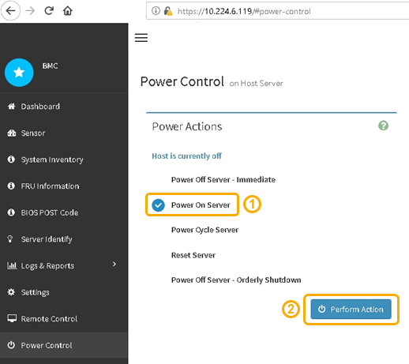

= 打开 SG6000-CN 控制器的电源并验证其运行情况
:allow-uri-read: 
:icons: font
:imagesdir: ../media/

[role="lead"]
完成维护后，打开控制器电源。

.开始之前
* 您已将控制器安装在机柜或机架中并连接了数据和电源线。
+
link:reinstalling-sg6000-cn-controller-into-cabinet-or-rack.html["将 SG6000-CN 控制器重新安装到机柜或机架中"]

* 您已将控制器物理定位在数据中心中。
+
link:locating-controller-in-data-center.html["在数据中心中找到控制器"]

.步骤
. 启动 SG6000-CN 控制器，并使用以下方法之一监控控制器 LED 和启动代码：
+
** 按下控制器正面的电源开关。
+
image::../media/sg6060_front_panel_power_led_off.jpg[SG6060 前面板电源 LED —关闭]

** 使用控制器 BMC 界面：
+
... 访问控制器 BMC 界面。
+
link:../installconfig/accessing-bmc-interface.html["访问 BMC 界面"]

... 选择 * 电源控制 * 。
... 选择 * 启动服务器 * ，然后选择 * 执行操作 * 。
+

+
使用 BMC 界面监控启动状态。

. 确认设备控制器显示在网格管理器中且未显示任何警报。
+
控制器可能需要长达 20 分钟才能显示在网格管理器中。

. 确认新的 SG6000-CN 控制器已完全正常运行：
+
.. 使用 PuTTY 或其他 ssh 客户端登录到网格节点：
+
... 输入以下命令： `ssh admin@_grid_node_IP_`
... 输入中列出的密码 `Passwords.txt` 文件
... 输入以下命令切换到root： `su -`
... 输入中列出的密码 `Passwords.txt` 文件
+
以root用户身份登录后、提示符将从变为 `$` to `#`。

.. 输入以下命令并验证其是否返回预期输出：+
`cat /sys/class/fc_host/*/port_state`
+
预期输出：

+
[listing]
----
Online
Online
Online
Online
----
+
如果未返回预期输出，请联系技术支持。

.. 输入以下命令并验证其是否返回预期输出：+
`cat /sys/class/fc_host/*/speed`
+
预期输出：

+
[listing]
----
16 Gbit
16 Gbit
16 Gbit
16 Gbit
----
+
如果未返回预期输出，请联系技术支持。

.. 在网格管理器的节点页面中，确保设备节点已连接到网格，并且没有任何警报。
+

CAUTION: 除非此设备具有绿色图标、否则请勿使其他设备节点脱机。

. 可选：如果已卸下前挡板，请安装前挡板。

.相关信息
link:../installconfig/viewing-status-indicators.html["查看状态指示器"]
