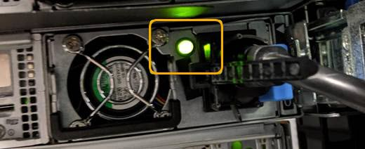

= 关闭 SG6000-CN 控制器
:allow-uri-read: 
:icons: font
:imagesdir: ../media/

[role="lead"]
关闭 SG6000-CN 控制器以执行硬件维护。

.开始之前
* 您已将需要维护的 SG6000-CN 控制器物理定位在数据中心。请参见 link:locating-controller-in-data-center.html["在数据中心中找到控制器"]。

.关于此任务
要防止服务中断，请在可以接受服务中断期间的计划维护窗口期间关闭控制器或关闭控制器之前，确认所有其他存储节点均已连接到网格。请参见有关的信息 link:../monitor/monitoring-system-health.html#monitor-node-connection-states["监控节点连接状态"]。

IMPORTANT: 如果您使用的 ILM 规则只创建一个对象的一个副本，则必须在计划的维护窗口期间关闭控制器。否则，在此操作步骤 期间，您可能暂时无法访问这些对象。+ 查看有关通过信息生命周期管理管理对象的信息。

.步骤
. 关闭SG6000-CN控制器。
+

CAUTION: 您必须输入以下指定的命令，以有控制的方式关闭设备。最佳做法是、尽可能执行可控关闭、以避免不必要的警报、确保完整日志可用并避免服务中断。

+
.. 如果尚未登录到网格节点、请使用PuTTY或其他ssh客户端登录：
+
... 输入以下命令： `ssh admin@_grid_node_IP_`
... 输入中列出的密码 `Passwords.txt` 文件
... 输入以下命令切换到root： `su -`
... 输入中列出的密码 `Passwords.txt` 文件
+
以root用户身份登录后、提示符将从变为 `$` to `#`。

.. 关闭SG6000-CN控制器：+
`*shutdown -h now*`
+
此命令可能需要长达 10 分钟才能完成。

. 使用以下方法之一验证 SG6000-CN 控制器是否已关闭：
+
** 查看控制器正面的蓝色电源 LED ，确认其已关闭。
+
image::../media/sg6060_front_panel_power_led_off.jpg[SG6060 前面板电源 LED —关闭]

** 查看控制器背面两个电源上的绿色 LED ，确认它们以正常速率闪烁（大约每秒闪烁一次）。
+

** 使用控制器 BMC 界面：
+
... 访问控制器 BMC 界面。
+
link:../installconfig/accessing-bmc-interface.html["访问 BMC 界面"]

... 选择 * 电源控制 * 。
... 验证电源操作是否指示主机当前已关闭。
+
image::../media/bmc_power_control_page_controller_off.png[BMC 电源控制页面—控制器关闭]

.相关信息
link:removing-sg6000-cn-controller-from-cabinet-or-rack.html["从机柜或机架中卸下 SG6000-CN 控制器"]
