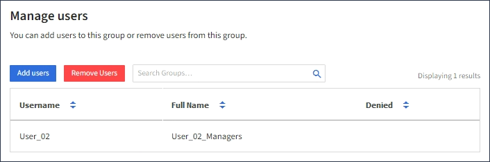

= 将用户添加到本地组
:allow-uri-read: 
:icons: font
:imagesdir: ../media/

[role="lead"]
您可以根据需要将用户添加到本地组。

.开始之前
* 您将使用登录到租户管理器 link:../admin/web-browser-requirements.html["支持的 Web 浏览器"]。
* 您属于具有root访问权限的用户组。

.步骤
. 选择 * 访问管理 * > * 组 * 。
. 选择要将用户添加到的本地组的名称。
+
或者，您也可以选择 * 操作 * > * 查看组详细信息 * 。

+
此时将显示组详细信息页面。

+
image::../media/tenant_group_details.png[查看组详细信息]

. 选择 * 用户 * ，然后选择 * 添加用户 * 。
+

. 选择要添加到组中的用户，然后选择 * 添加用户 * 。
+
image::../media/add_users_to_group.png[将用户添加到组]

+
页面右上角将显示一条确认消息。

