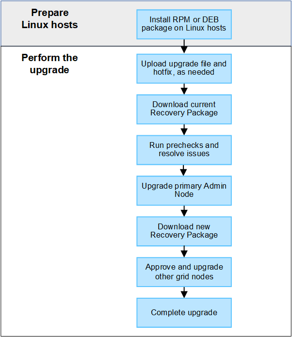

= 升级工作流
:allow-uri-read: 
:icons: font
:imagesdir: ../media/

[role="lead"]
开始升级之前，请查看常规工作流。StorageGRID 升级页面将指导您完成每个升级步骤。

. 如果在 Linux 主机上部署了任何 StorageGRID 节点， link:linux-installing-rpm-or-deb-package-on-all-hosts.html["在每个主机上安装 RPM 或 Deb 软件包"] 开始升级之前。
. 如果需要、从主管理节点访问StorageGRID 升级页面并上传升级文件和修补程序文件。
. 下载当前的恢复软件包。
. 在开始实际升级之前、运行升级预检以检测并解决任何问题。
. 启动升级，此过程将自动运行预检并升级主管理节点。升级主管理节点时、您无法访问网格管理器。审核日志也将不可用。此升级可能需要长达 30 分钟的时间。
. 升级主管理节点后、下载新的恢复软件包。
. 批准网格节点。您可以批准单个网格节点，一组网格节点或所有网格节点。
+

IMPORTANT: 除非您确定网格节点已做好停止和重新启动的准备、否则请勿批准该节点的升级。

. 恢复操作。升级完所有网格节点后，将启用新功能，您可以恢复操作。您必须等待执行停用或扩展操作步骤 ，直到完成后台*升级数据库*任务和*最终升级步骤*任务。

.相关信息
link:estimating-time-to-complete-upgrade.html["估计完成升级所需的时间"]
